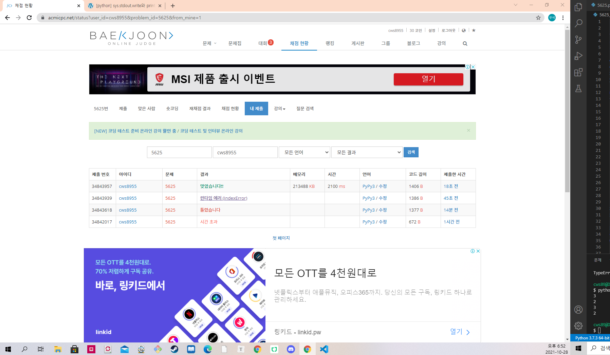

[ 백준 : 페스트리 ] (https://www.acmicpc.net/problem/5625)


- 누적합문제이다.
- 삼각형의 x좌표 세 개중 제일 큰 값과 작은 값
- 마찬가지로 y좌표의 세 개중 제일 큰 값과 작은 값
- 그 사이로 자르면 페스트리가 잘린다.


이걸 기준으로 모든 페스트리를 잘랐는데 처음에는 시간초과가 났다.

그래서 deque와 heapq 자료구조를 활용해 작은 값보다 클경우 누적시키고 현재 위치가 큰 값보다 클경우 누적값에서 빼주면서 문제를 해결했다.


```python
import sys
sys.stdin = open('5625.txt','r')
from collections import deque
input = sys.stdin.readline
import heapq

divide_x = [0]*1000001
divide_y = [0]*1000001
xq = []
yq = []

n = int(input())
for p in range(n):
    pastry = list(map(int,input().split()))
    max_x = max(pastry[0],pastry[2],pastry[4])
    min_x = min(pastry[0],pastry[2],pastry[4])
    max_y = max(pastry[1],pastry[3],pastry[5])
    min_y = min(pastry[1],pastry[3],pastry[5])

    if abs(max_x) == abs(min_x)+1:
        pass
    else:
        xq.append([min_x+1,max_x-1])

    if abs(max_y) == abs(min_y)+1:
        pass
    else:
        yq.append([min_y+1,max_y-1])

xq.sort(key=lambda x:(x[0],x[1]))
xq = deque(xq)

xxq = []
cnt = 0
while cnt <= 1000000:
    while xxq and xxq[0][0] == cnt:
        heapq.heappop(xxq)


    while xq and xq[0][0] == cnt:
        start, end = xq.popleft()
        heapq.heappush(xxq,[end+1])

    divide_x[cnt] = len(xxq)
    cnt += 1

yq.sort(key=lambda y:(y[0],y[1]))
yq = deque(yq)

yyq = []
cnt = 0
while cnt <= 1000000:
    while yyq and yyq[0][0] == cnt:
        heapq.heappop(yyq)


    while yq and yq[0][0] == cnt:
        start, end = yq.popleft()
        heapq.heappush(yyq,[end+1])

    divide_y[cnt] = len(yyq)
    cnt += 1

m = int(input())
for s in range(m):
    arr = list(map(str,input().split(' ')))
    d = arr[0]
    p = int(arr[2])

    if d == 'x':
        print(divide_x[p])
    else:
        print(divide_y[p])
```

