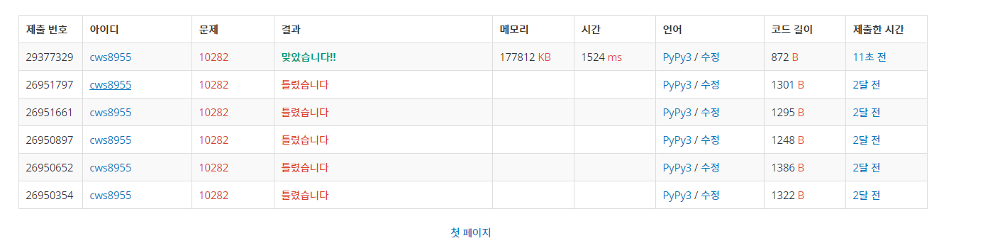

[백준 : 해킹] (https://www.acmicpc.net/problem/10282)


- 예전에 왜 못풀었는지 이해가 안되는 문제
- 단순한 단방향 다익스트라 문제다


```python
import sys
sys.stdin = open('10282.txt','r')
import heapq

def dijkstra():
    global n,d,c,roads

    answer = [float('inf')]*(n+1)
    pq = []
    answer[c] = 0
    heapq.heappush(pq,[answer[c],c])
    number = 0
    last = c

    while pq:
        now_time , now_position = heapq.heappop(pq)

        if answer[now_position] < now_time:
            continue

        number += 1
        last = now_time

        for nxt,wt in roads[now_position].items():
            time = now_time + wt
            if answer[nxt] > time:
                answer[nxt] = time
                heapq.heappush(pq,[answer[nxt],nxt])

    return [number,last]

t = int(input())
for _ in range(t):
    n,d,c = map(int, input().split())
    roads = {node:{} for node in range(n+1)}

    for _ in range(d):
        a,b,w = map(int, input().split())
        roads[b][a] = w

    ans = dijkstra()
    print(ans[0], end =' ')
    print(ans[1])
```

