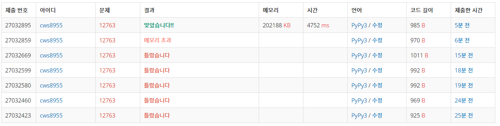

[백준 12763 : 지각하면 안돼] (https://www.acmicpc.net/problem/12763)


### 다익스트라!!!!


중복 위치에 대한 문제를 생각하는게 살짝 포인트!!!! 하지만 다익스트라에 익숙하다면 쉽게 풀 수 있다.


```python
import sys
sys.stdin = open('12763.txt','r')
import heapq

def dijkstra():
    global n,time,money,roads,ans

    answer = [float('inf')]*(n+1)
    answer[1] = 0
    pq = []
    heapq.heappush(pq,[answer[1],1,0])

    while pq:
        now_fee , now_position , now_time = heapq.heappop(pq)

        if now_position == n and now_fee <= money:
            ans = now_fee
            break

        if answer[now_position] < now_fee:
            continue

        for nxt , wt in roads[now_position].items():
            fee = now_fee + wt[1]
            times = now_time + wt[0]

            if fee <= money and times <= time: ### 여기 줄이 핵심!!!!!
                answer[nxt] = fee
                heapq.heappush(pq,[fee,nxt,times])
    return 

n = int(input())
time,money = map(int, input().split())
m = int(input())

roads = {node:{} for node in range(n+1)}

for _ in range(m):
    s,e,t,mo = map(int,input().split())
    roads[s][e] = [t,mo]
    roads[e][s] = [t,mo]


ans = 10000000
dijkstra()

if ans == 10000000:
    print(-1)
else:
    print(ans)


```


###### 문제 분류가 dfs로도 되어있는데 dfs로도 풀어봐야겠다. 


