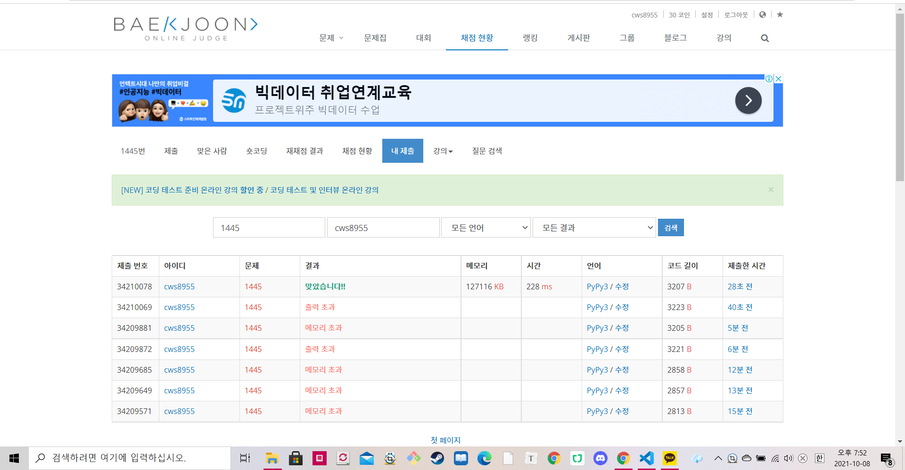

[ 백준 : 일요일 아침의 데이트 ] (https://www.acmicpc.net/problem/1445)


- 구현과정에서 분기를 많이해줘야 해서 조금 귀찮았던 문제
- +1을 안해줘서 메모리초과가 계속 났었다.......


```python
import sys
sys.stdin = open('1445.txt','r')
import heapq

n,m = map(int, input().split())
arr = []
for _ in range(n):
    ar = list(input())
    arr.append(ar)

trashs = []

dy = [0,0,-1,1]
dx = [1,-1,0,0]
sy,sx,fy,fx = None,None,None,None

for y in range(n):
    for x in range(m):
        if arr[y][x] == 'g':
            for k in range(4):
                ny = y+dy[k]
                nx = x+dx[k]
                if 0<=ny<n and 0<=nx<m:
                    if arr[ny][nx] == '.':
                        arr[ny][nx] = 'b'
        elif arr[y][x] == 'S':
            sy = y
            sx = x
        elif arr[y][x] == 'F':
            fy = y
            fx = x

answer = [[[float('inf'),float('inf')] for _ in range(m)] for _ in range(n)] 
pq = []
answer[sy][sx] = [0,0]
heapq.heappush(pq,[answer[sy][sx][0] , answer[sy][sx][0] , sy, sx])

final = [float('inf'),float('inf')]

ending = False
end_point = float('inf')
while pq:
    trash,side,y,x, = heapq.heappop(pq)

    if y == fy and x == fx:
        end_point = trash
        final[0] = trash
        if side < final[1]:
            final[1] = side
        if final[0] == 0:
            break

    if end_point < trash:
        break

    for k in range(4):
        ny = y+dy[k]
        nx = x+dx[k]
        if 0<=ny<n and 0<=nx<m:
            if answer[ny][nx][0] <= trash:
                continue
            
            if arr[ny][nx] == 'g':
                if answer[ny][nx][0] > trash+1:
                    answer[ny][nx][0] = trash+1
                    answer[ny][nx][1] = side
                    heapq.heappush(pq,[trash +1 , side , ny ,nx ])
                elif answer[ny][nx][0] == trash+1:
                    if answer[ny][nx][1] > side:
                        answer[ny][nx][0] = trash+1
                        answer[ny][nx][1] = side
                        heapq.heappush(pq,[trash+1 , side , ny ,nx ])
            elif arr[ny][nx] == 'b':
                if answer[ny][nx][0] > trash:
                    answer[ny][nx][0] = trash
                    answer[ny][nx][1] = side+1
                    heapq.heappush(pq,[trash,side+1,ny,nx])
                elif answer[ny][nx] == trash:
                    if answer[ny][nx][1] > side+1:
                        answer[ny][nx][1] = side+1
                        heapq.heappush(pq,[trash,side+1,ny,nx])
            elif arr[ny][nx] == '.':
                if answer[ny][nx][0] > trash:
                    answer[ny][nx][0] = trash
                    answer[ny][nx][1] = side
                    heapq.heappush(pq,[trash,side,ny,nx])
                elif answer[ny][nx] == trash:
                    if answer[ny][nx][1] > side:
                        answer[ny][nx][1] = side
                        heapq.heappush(pq,[trash,side,ny,nx])
            elif arr[ny][nx] == 'F':
                if answer[ny][nx][0] > trash:
                    answer[ny][nx][0] = trash
                    answer[ny][nx][1] = side
                    heapq.heappush(pq,[trash,side,ny,nx])
                elif answer[ny][nx] == trash:
                    if answer[ny][nx][1] > side:
                        answer[ny][nx][1] = side
                        heapq.heappush(pq,[trash,side,ny,nx])


for f in final:
    print(f, end = ' ')


print(answer)
```



