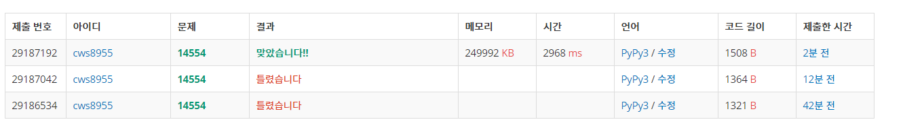

[백준 : The Other Way ] (https://www.acmicpc.net/problem/14554)


- 생각할 거리가 많았던 문제
- 아이디어를 생각하는데 시간이 오래걸렸던 문제
- 아이디어
- 처음에 arr 그래프를 만들때 최소거리와 같은 거리를 가진 거리의 수를 넣어준 후 거리를 계속 곱하면서 풀었다. 
  - 예를들어 1에서 2를 가는게 1인 1 2 1 이 세개가 주어졌으면
  - 그래프의 arr{1}{2} = [1(거리) , 3(개수)] 이런식으로 그래프를 완성한 후 활용한다


```python
import sys
sys.stdin = open('16475.txt','r')
import heapq

def dijkstra():
    global n,m,s,e,arr,answers

    answer= [[float('inf'),0] for _ in range(n+1)]
    pq = []
    answer[s][0] = 0
    heapq.heappush(pq,[answer[s][0],s,1])
    first_distance = None

    while pq:
        now_distance , now_positon, numbers = heapq.heappop(pq)

        if first_distance != None and now_distance > first_distance:
            break

        if now_positon == e:
            first_distance = now_distance
            answer[now_positon][1] += numbers

        if answer[now_positon][0] < now_distance:
            continue

        for nxt_route in arr[now_positon].keys():
            wt = arr[now_positon][nxt_route][0]
            number = arr[now_positon][nxt_route][1]
            if number > 0:
                distance = now_distance+wt
                if answer[nxt_route][0] >= distance:
                    answer[nxt_route][0] = distance
                    heapq.heappush(pq,[answer[nxt_route][0],nxt_route,numbers*number])

    answers = answer[e][1] % ((10**9)+9)
    return

n,m,s,e = map(int, input().split())
arr = {node:{} for node in range(n+1)}

for _ in range(m):
    a,b,w = map(int, input().split())
    value = arr.get(a)
    vv= value.get(b)
    if vv == None:
        arr[a][b] = [w,1]
        arr[b][a] = [w,1]
    # print(arr[a][b])
    elif arr[a][b][0] == w:
        arr[a][b][1] += 1
        arr[b][a][1] += 1
    elif arr[a][b][0] > w:
        arr[a][b][0] = w
        arr[a][b][1] = 1

answers = False
dijkstra()
print(answers)
```

