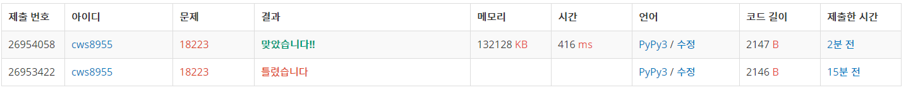

[백준 - 민준이와 마산 그리고 건우] (https://www.acmicpc.net/problem/18223)


- 다익스트라
- 로직
  - a = 민준이가 마산으로 가는 최소값
  - b = 민준이가 건우 만나는 최소값 + 건우위치에서 마산 가는 최소 값
  - a보다 b가 크지 않으면 save him , 크다면 good bye


```python
import sys
sys.stdin = open('18223.txt','r')
import heapq 

문제 풀이 날짜 2021.03.04

def dijkstra():
    global n,m,p,roads,short

    answer = [float('inf')]*(n+1)
    answer[1] = 0
    pq = []
    heapq.heappush(pq,[answer[1],1])

    while pq:
        now_distance, now_position = heapq.heappop(pq)

        if answer[now_position] < now_distance:
            continue

        for nxt , wt in roads[now_position].items():
            distance = now_distance + wt

            if answer[nxt] > distance:
                answer[nxt] = distance
                heapq.heappush(pq,[answer[nxt],nxt])

    answer = answer[1:]
    short = answer[n-1]

    return

def dijkstra_go1(start,end):
    global n,m,p,roads,short,save

    answer = [float('inf')]*(n+1)
    answer[start] = 0
    pq = []
    heapq.heappush(pq,[answer[start],start])

    while pq:
        now_distance, now_position = heapq.heappop(pq)

        if answer[now_position] < now_distance:
            continue

        for nxt , wt in roads[now_position].items():
            distance = now_distance + wt

            if answer[nxt] > distance:
                answer[nxt] = distance
                heapq.heappush(pq,[answer[nxt],nxt])

    save += answer[p]

    return


def dijkstra_go2(start,end):
    global n,m,p,roads,short,save

    answer = [float('inf')]*(n+1)
    answer[start] = 0
    pq = []
    heapq.heappush(pq,[answer[start],start])

    while pq:
        now_distance, now_position = heapq.heappop(pq)

        if answer[now_position] < now_distance:
            continue

        for nxt , wt in roads[now_position].items():
            distance = now_distance + wt

            if answer[nxt] > distance:
                answer[nxt] = distance
                heapq.heappush(pq,[answer[nxt],nxt])

    save += answer[n]

    return


n,m,p= map(int, input().split())
roads = {node:{} for node in range(n+1)}

for _ in range(m):
    s,e,w = map(int,input().split())
    value = roads.get(s)
    vv = value.get(e)
    if vv == None or vv > w:
        roads[s][e] = w
        roads[e][s] = w

short = 0

dijkstra()

save = 0
dijkstra_go1(1,p)


dijkstra_go2(p,n)


if short < save:
    print("GOOD BYE")
else:
    print("SAVE HIM")

```


다음부터는 여러개의 다익스트라를 돌릴경우 코드가 보다 깔끔해지게 하나 안에서 가능하다면 할 수 있게 만들어야 겠다.





첫 번째 틀린것은 정말 사소한 오류...... 후 코테에서 이런 에러때문에 멘탈 나가면 너무 힘들듯 ㅠㅠㅠ