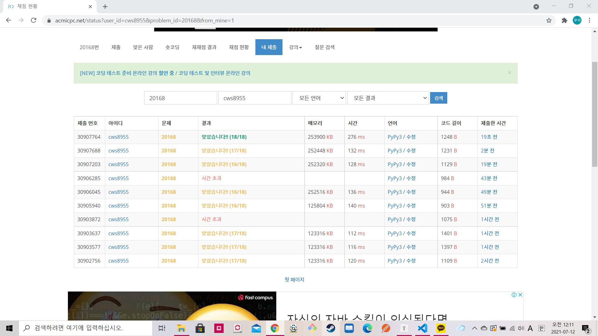

[백준 : 골목 대장 호석 - 기능성 ] (https://www.acmicpc.net/problem/20168)


- 대체 틀린 하나의 케이스는 무엇일까??? 
  - 나중에 다시 풀어봐야겠다
  - 다익스트라가 아닌 백트래킹으로 겨우 전부 풀었다......


```python
import sys
sys.stdin = open('20168.txt','r')
import heapq

def dijkstra():
    global n,m,start,end,money,roads

    answer = [float('inf')]*(n+1)
    pq = []
    answer[start] = 0
    heapq.heappush(pq,[answer[start],start,0])
    res = float('inf')

    while pq:
        total,now,_max = heapq.heappop(pq)

        if now == end:
            if _max < res:
                res = _max

        if answer[now] < total:
            continue

        for nxt, wt in roads[now].items():
            new_total = total + wt
            if answer[nxt] > new_total and money >= new_total:
                answer[nxt] = new_total
                if _max < wt:
                    heapq.heappush(pq,[answer[nxt],nxt,wt])
                else:
                    heapq.heappush(pq,[answer[nxt],nxt,_max])

    if res == float('inf'):
        return False
    else:
        return res


n,m,start,end,money = map(int,input().split())
roads = {node:{} for node in range(n+1)}

for _ in range(m):
    a,b,w = map(int, input().split())
    roads[a][b] = w
    roads[b][a] = w

result = dijkstra()

if result == False:
    print(-1)
else:
    print(result)
```


```python
## 두번째 코드

import sys
sys.stdin = open('20168.txt','r')
import heapq

def dijkstra():
    global n,m,start,end,money,roads

    answer = [float('inf')]*(n+1)
    pq = []
    answer[start] = 0
    heapq.heappush(pq,[answer[start],start,0])
    res = float('inf')

    while pq:
        total,now,_max = heapq.heappop(pq)

        if now == end:
            if _max < res:
                res = _max

        if answer[now] < total:
            continue

        for nxt, wt in roads[now].items():
            new_total = total + wt
            if nxt != end:
                if answer[nxt] > new_total and money >= new_total:
                    answer[nxt] = new_total
                    if _max < wt:
                        heapq.heappush(pq,[answer[nxt],nxt,wt])
                    else:
                        heapq.heappush(pq,[answer[nxt],nxt,_max])
            else:
                if money >= new_total:
                    if _max < wt:
                        heapq.heappush(pq,[answer[nxt],nxt,wt])
                    else:
                        heapq.heappush(pq,[answer[nxt],nxt,_max])


    if res == float('inf'):
        return False
    else:
        return res


n,m,start,end,money = map(int,input().split())
roads = {node:{} for node in range(n+1)}

for _ in range(m):
    a,b,w = map(int, input().split())
    roads[a][b] = w
    roads[b][a] = w

result = dijkstra()

if result == False:
    print(-1)
else:
    print(result)
```


```python
### 마지막 백트래킹+비트마스킹 정답 코드

import sys
sys.setrecursionlimit(10**5)
sys.stdin = open('20168.txt','r')

def dfs(now,vis,_max,total):
    global n,m,start,end,money,roads,visit,result

    # print('------',now,bin(vis),_max,total)

    if total > money:
        return

    if now == end:
        if result > _max:
            result = _max
        return

    for nxt,wt in roads[now].items():
        if not vis&(1<<nxt):
            new_total = total + wt
            # print('1',bin(vis))
            new_vis = vis|(1<<nxt)
            # print('2',bin(new_vis),nxt)
            if new_total <= money:
                if visit[nxt][new_vis] == 0:
                    visit[nxt][new_vis] = 1
                    # print('++')
                    if wt < _max:
                        dfs(nxt,new_vis,_max,new_total)
                    else:
                        dfs(nxt,new_vis,wt,new_total)
                    visit[nxt][new_vis] = 0

    return
            


n,m,start,end,money = map(int,input().split())
roads = {node:{} for node in range(n+1)}
visit = [[0]*(1<<n+1) for _ in range(n+1)]
result = float('inf')

for _ in range(m):
    a,b,w = map(int, input().split())
    roads[a][b] = w
    roads[b][a] = w

dfs(start,(1<<start),0,0)

if result == float('inf'):
    print(-1)
else:
    print(result)
```

