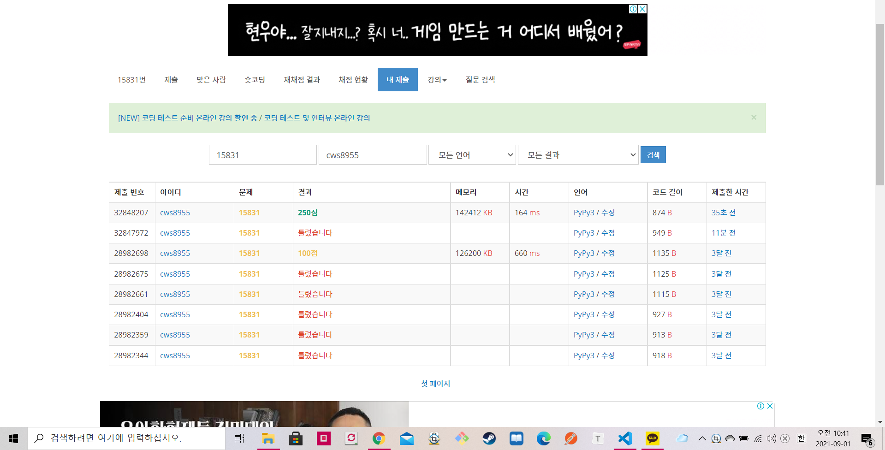

[ 백준 : 준표의 조약돌 ] (https://www.acmicpc.net/problem/15831)


- 예전에 부분성공만 했던 문제를 다시 풀었다.
- 다시풀어보니 너무 쉬운데...... 과거에는 왜 못풀었지
- 너무 단순한 두포인터 문제이다.
- start와 end는 포인터의 위치
- black과 white는 가지고 있는 조약돌의 색깔
- answer는 현재의 길이
- final은 최소로 가져야할 흰돌과 최대로 가져야할 검은돌을 기준으로 지속적으로 갱신한 최종 값


```python
import sys
sys.stdin = open('15831.txt','r')

ll,b,w = map(int,input().split())
arr = ['S']+list(input())

start = 0
end = 0
black = 0
white = 0
answer = 0
final = 0

while True:

    if black<=b and white >=w:
        if final < answer:
            final = answer

    if end != ll:
        if arr[end+1] == 'W':
            end += 1
            white += 1
            if black <= b:
                answer += 1
        else:
            if black < b:
                end += 1
                black += 1
                if black <= b:
                    answer += 1
            else:
                if arr[start+1] == 'B':
                    start += 1
                    black -= 1
                    answer -= 1
                else:
                    start += 1
                    white -= 1
                    answer -= 1
    else:
        break
        
print(final)
```

