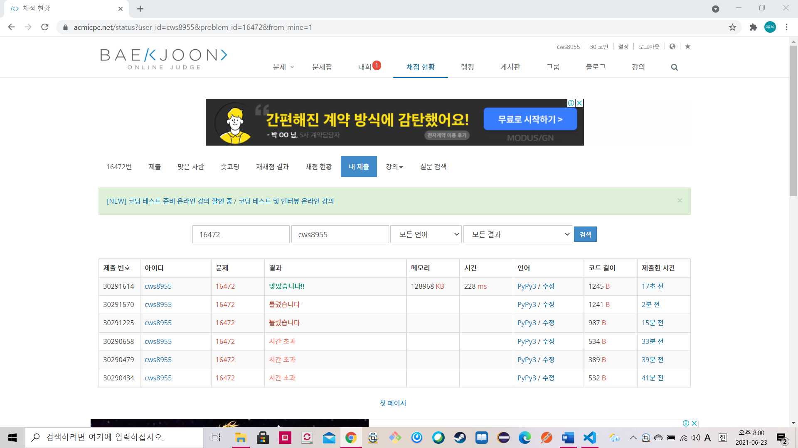

[백준 : 고냥이] (https://www.acmicpc.net/problem/16472)


- 시간초과를 해결하는데 애먹었던 문제
- 시간초과를 해결하기위해 방법을 생각하던 중 알파벳이 26자라는 데에서 힌트를 얻었으며 알파벳의 아스키 코드를 활용한 brr 배열을 추가적으로 만들었고 이를 활용하여 시간초과를 해결하였다.


```python
import sys
sys.stdin = open('16472.txt','r')
from collections import deque

n = int(input())
arr = list(input())
l = len(arr)-1


start = 0
end = 0
answer = 0

brr = [0]*26
brr[ord(arr[end])-97] += 1

while start != l:

    s = brr.count(0)
    ss = 26 - s
    # print(start,end,answer,ss)

    if ss <= n:
        if end < l:
            brr[ord(arr[end+1])-97] += 1
            end += 1
            a = brr.count(0)
            aa = 26 - a
            # print(aa,n,start,end,answer)
            if aa <= n:
                if answer < end - start +1:
                    answer = end - start +1
            else:
                # print('==================================')
                brr[ord(arr[start])-97] -= 1
                start += 1

        else:
            brr[ord(arr[start])-97] -= 1
            start += 1
    else:
        if start<end:
            brr[ord(arr[start])-97] -= 1
            start += 1


    # ll = len(set(brr))
    # if ll <= n:
    #     if end < l:
    #         end += 1
    #         brr.append(arr[end])
    #         if answer < end-start:
    #             answer = end - start
    #     else:
    #         start += 1
    #         brr.popleft()
    # else:
    #     if start < end:
    #         start += 1
    #         brr.popleft()

print(answer)
```

