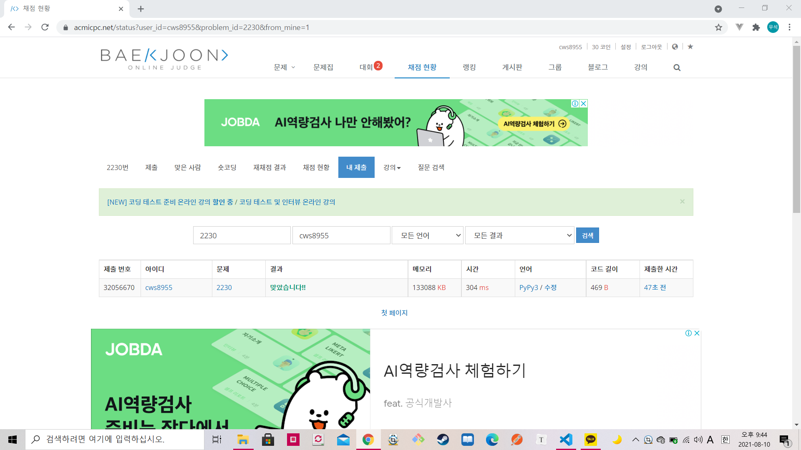

[ 백준 : 수 고르기 ] (https://www.acmicpc.net/problem/2230)


- 국민은행 최종면접 탈락하고 알고리즘 하나 겨우 풀었다...... 아무것도 손에 안잡힌다.
- 2021.08.10에 푼 문제

- 간단한 두 포인터 문제지만 내가 녹슬어서 오래걸린 문제


```python
import sys
sys.stdin = open('2230.txt','r')

n,m = map(int, input().split())
arr = []
for _ in range(n):
    a = int(input())
    arr.append(a)

arr.sort()

left = 0
right = 0
answer = float('inf')

while left != n-1:
    if m<=arr[right] - arr[left]:
        if m<=arr[right]-arr[left] <=answer:
            answer = arr[right]-arr[left]
        left += 1
    else:
        if right != n-1:
            right += 1
        else:
            left += 1
        
    

print(answer)

                    

```

