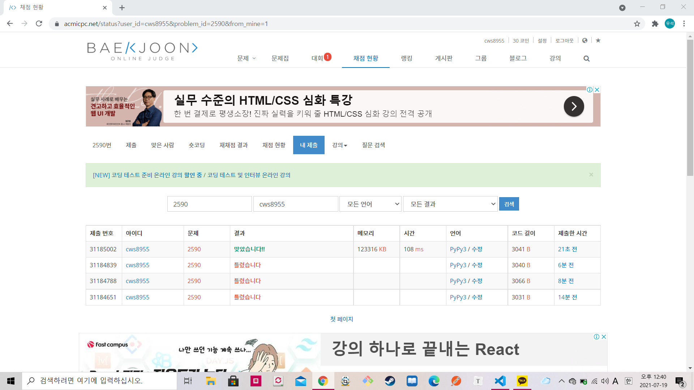

[ 백준 : 색종이 ] (https://www.acmicpc.net/problem/2590)


- 조건이 많은 구현문제이다.
- 그리디하게 6부터 1까지 순차적으로 스티커를 붙힐 수 있는 경우에는 계속 붙혀주면서 풀었다
- 이런 구현 문제 너무 힘들다......


```python
import sys
sys.stdin = open('2590.txt','r')
arr = []
arr.append(0)
for _ in range(6):
    a = int(input())
    arr.append(a)

answer = 0

answer += arr[6]
arr[6] = 0

cnt = 0
while cnt < arr[5]:
    arr[5] -= 1
    answer += 1
    
    ct_1 = 0
    while ct_1 < 11:
        if arr[1] > 0:
            arr[1] -= 1
            ct_1 += 1
        else:
            break


cnt = 0 
while cnt < arr[4]:
    arr[4] -= 1
    answer += 1
    pan = 20
    while pan > 0:
        if arr[2] > 0:
            arr[2] -= 1
            pan -= 4
        else:
            break

    while pan > 0:
        if arr[1] > 0:
            arr[1] -= 1
            pan -= 1
        else:
            break

cnt = 0 
if arr[3] > 0:
    a3 = arr[3] // 4
    a3_ = arr[3] % 4

    if a3_ == 0:
        answer += a3
        arr[3] -= a3*4
    else:
        answer += (a3+1)
        arr[3] -= a3_
        if a3_ == 1:
            arr[3] -= 1
            pan1 = 7
            pan2 = 5
            cnt1 = 0
            cnt2 = 0
            while cnt2 < 5:
                if arr[2] > 0:
                    cnt2 += 1
                    arr[2] -= 1
                else:
                    break

            if cnt2 < pan2:
                pan1 += (pan2-cnt2) * 4

            while cnt1 < pan1:
                if arr[1] > 0:
                    cnt1 += 1
                    arr[1] -= 1
                else:
                    break

        elif a3_ == 2:
            arr[3] -= 2
            pan1 = 6
            pan2 = 3
            cnt1 = 0
            cnt2 = 0
            while cnt2 < pan2:
                if arr[2] > 0:
                    cnt2 += 1
                    arr[2] -= 1
                else:
                    break

            if cnt2 < pan2:
                pan1 += (pan2-cnt2) * 4

            while cnt1 < pan1:
                if arr[1] > 0:
                    cnt1 += 1
                    arr[1] -= 1
                else:
                    break

        elif a3_ == 3:
            arr[3] -= 3
            pan1 = 5
            pan2 = 1
            cnt1 = 0
            cnt2 = 0
            while cnt2 < pan2:
                if arr[2] > 0:
                    cnt2 += 1
                    arr[2] -= 1
                else:
                    break

            if cnt2 < pan2:
                pan1 += (pan2-cnt2) * 4

            while cnt1 < pan1:
                if arr[1] > 0:
                    cnt1 += 1
                    arr[1] -= 1
                else:
                    break

cnt = 0
if arr[2] > 0:
    a2 = arr[2] // 9
    a2_ = arr[2] % 9

    if a2_ == 0:
        answer += a2
        arr[2] -= a2*9
    else:
        answer += (a2+1)
        arr[2] -= a2_
        pan1 = 36
        cnt1 = 0
        pan1 -= (a2_ * 4)
        while cnt1 <pan1:
            if arr[1] > 0:
                arr[1] -= 1
                cnt1 += 1
            else:
                break

if arr[1] > 0:
    a1 = arr[1] // 36
    a1_ = arr[1] % 36
    if a1_ == 0:
        answer += a1
        arr[1] -= a1*36
    else:
        answer += a1+1
        arr[2] -= a1_


print(answer)
```

