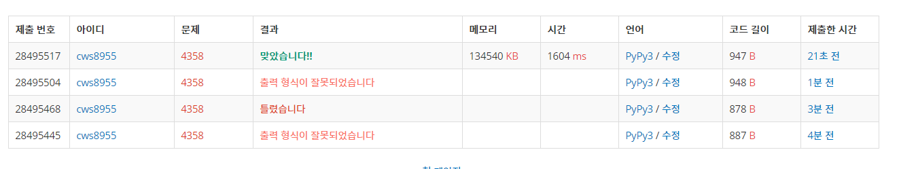

[ 백준 : 생태학 ] (https://www.acmicpc.net/problem/4358)


##### 2021.04.19


- 해쉬와 집합을 이용한 문제
- 로직은 defaultdict를 이용하여 해시를 활용하는 집합을 만든다
- 집합은 딕셔너리 형태로 (시작하는 문자)(길이)(문자) : 개수 이런식으로 저장되도록 한다.


```python
import sys
sys.stdin = open('4358.txt','r')
from collections import defaultdict

_dict = defaultdict(dict)

total_set = set()
total = 0

while True:
    try:
        tree = input()
        list_tree = list(tree)
        length = len(tree)
        head = list_tree[0]

        if len(_dict[head]) == 0:
            _dict[head] = defaultdict(dict)
        if len(_dict[head][length]) == 0:
            _dict[head][length] = defaultdict(dict)
            _dict[head][length][tree] = 0
        else:
            if _dict[head][length][tree] == {}:
                _dict[head][length][tree] = 0

        _dict[head][length][tree] += 1

        total_set.add(tree)
        total += 1

    except:
        break


total_set = list(total_set)

total_set.sort()

for t in total_set:
    print(t, end= ' ')
    head = t[0]
    length = len(t)
    percent = _dict[head][length][t]/total
    percent *= 100
    percent = round(percent,4)
    # print(round(percent,4))
    print("{:.4f}".format(percent))

    

```


