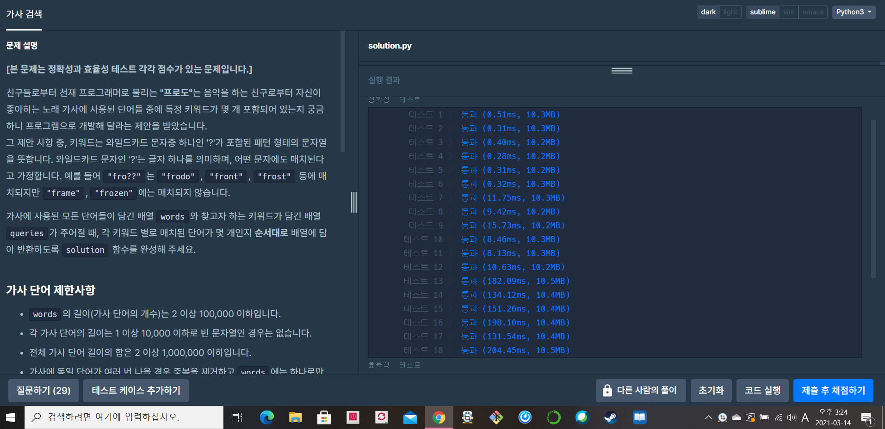
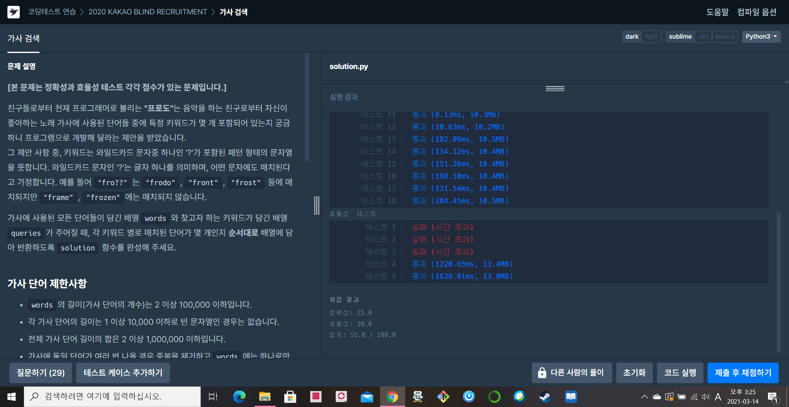

[프로그래머스  : 가사 검색] (https://programmers.co.kr/learn/courses/30/lessons/60060)


- 로직

- 전체 words가 활용되는 딕셔너리를 하나 만든다.

- 딕셔너리는의 키값은 단어의 길이로 만든다.

- 각 길이의 키 값을 갖는 딕셔너리에 처음 시작단어를 key값으로 갖는 딕셔너리를 내부에 또 만든다.

  - 예제의 경우 결론적으로 이런 딕셔너리가 구현된다.

  - ```python
    {5: {'f': ['frodo', 'front', 'frost', 'frame'], 'k': ['kakao']}, 6: {'f': ['frozen']}}
    ```

- queries의 단어들이 위의 만들어놓은 딕셔너리를 돌면서 원하는 값을 추가해준다.

  - 예를들어 queries의 "fro??"의 경우 5자리이고 시작단어가 f이므로 딕셔너리 [5] ['f']에서만 검색해주면 된다.

- 정확도 테스트는 전부 통과했지만 효율성는 일부만 통과했다. 조금 더 나은 알고리즘을 생각해봐야겠다.


2021.03.14 화이트데에에이에 푼 문제


```python
dictt = {}
result = []
length = set()

def search(cnt,string):
    global dictt,result,length
    
    s = string[0]
    l = len(string)
    # print(l,s)
    
    if s == '?':
        if l in length:
            for dic in dictt[l]:
                for word in dictt[l][dic]:
                    diff = len(word)
                    for w in range(len(word)):
                        if string[w] == word[w] or '?' == string[w]:
                            diff -= 1
                        else:
                            break
                    if diff == 0:
                        result[cnt] += 1
    if s != '?':
        if l in length:
            for word in dictt[l][s]:
                # print('---',l,word)
                diff = len(word)
                for w in range(len(word)):
                    if string[w] == word[w] or '?' == string[w]:
                        diff -= 1
                    else:
                        break
                if diff == 0:
                    result[cnt] += 1
                    
    # print(result)
                    
    return


def solution(words, queries):
    global dictt,result,length
    result = [0]*len(queries)
    dictt = {}
    for word in words:
        dictt[len(word)] = {}
        length.add(len(word))
        
    for word in words:
        dictt[len(word)][word[0]] = []
        
    for word in words:
        if dictt[len(word)][word[0]] is None:
            dictt[len(word)][word[0]].append(word)
        else:
            dictt[len(word)][word[0]].append(word)
            
    # print(dictt)
    # print(length)
    
    for query in range(len(queries)):
        search(query,queries[query])
        
        
        
    return result
```

!(20210314_152540.png)

