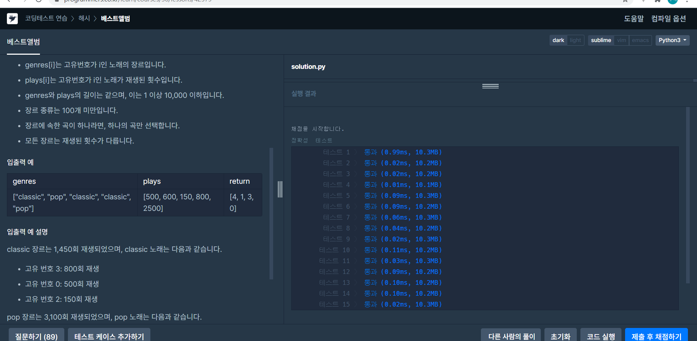

[프로그래머스 : 베스트 앨범] (https://programmers.co.kr/learn/courses/30/lessons/42579)


- 풀긴 풀었는데 시간을 거의 1시간을 썼다...... 이 정도 속도로는 어림도 없는데.....
- 너무 주먹구구식으로 푼 것같다. 필요한 자료형 있으면 그때 그때 새롭게 만드느라 시간도 오래걸리고 코드도 깔끔하지 않다. 처음에 문제풀이 방법에 대한 기획을 제대로 하는 연습을 더욱 해야겠다.


```python
from collections import defaultdict

def solution(genres, plays):
    answer = []
    length = len(genres)
    dict = {}
    genre_cnt = defaultdict(int)
    confirm_lst = []
    for leng in range(length):
         if genres[leng] not in confirm_lst:
                dict.setdefault(genres[leng],[])
                
    for leng in range(length):
        dict[genres[leng]].append([leng,plays[leng]])
        
    for dic in dict:
        dict[dic].sort(key = lambda x:x[1], reverse=True)
        
    genre_order = []
    for leng in range(length):
        genre_cnt[genres[leng]] += plays[leng]
        
    for leng in genre_cnt:
        genre_order.append((leng,genre_cnt[leng]))
    
    
    # print(genre_cnt)
    # print(genre_order)
    genre_order.sort(key=lambda x:x[1], reverse=True)
    # print(genre_order)
    # print(list(genre_cnt.keys()))
    # print(dict)
    
    stop = 0
    for gen in range(len(genre_order)):
        genre = genre_order[gen][0]
        # print(genre)
        for number in dict[genre]:
            if stop == 2:
                break
            answer.append(number[0])
            stop += 1
        stop = 0
            
    
    return answer
```

