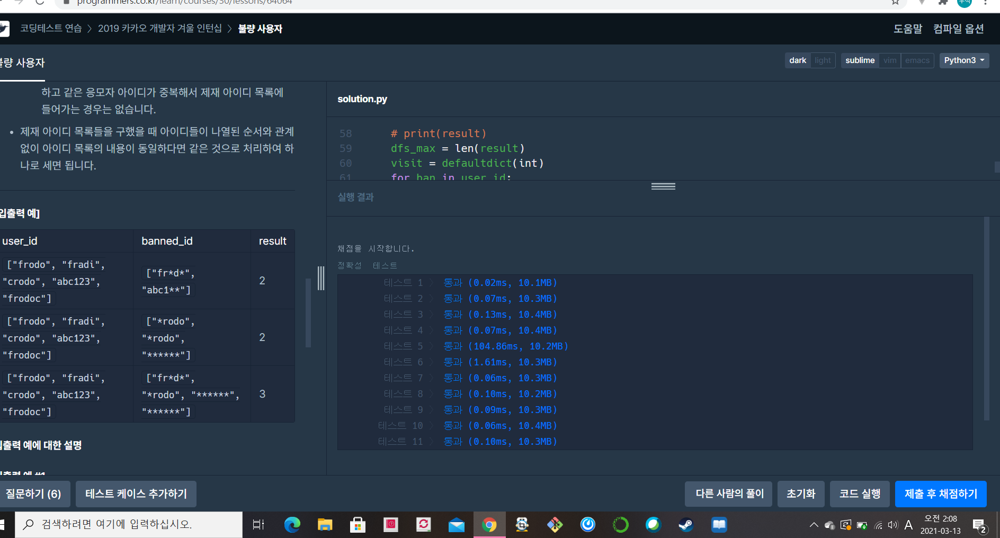

[프로그래머스 : 불량사용자] (https://programmers.co.kr/learn/courses/30/lessons/64064)


###### 각 금지 단어별로 적용가능한 user_id가 담긴 배열 구현 + dfs로 불량사용자 리스트 뽑기 + sort + set함수로 중복제거하기


```python
from itertools import *
from collections import defaultdict

result = []
dfs_max = 0
answer = 0
answer_lst = set()
visit = defaultdict()

def dfs(cnt):
    global dfs_max,answer, visit,result ,answer_lst
    
    if cnt == dfs_max:
        temp = []
        # print(visit)
        for vi in visit:
            # print(vi)
            if visit[vi] == -1:
                temp.append(vi)
        # print(temp)
        temp.sort(key = lambda x:x )
        temp = tuple(temp)
        answer_lst.add(temp)  
        return
    
    # print(result)
    for re in result[cnt]:
        # print(re)
        if visit[re] == 1:
            visit[re] = -1
            dfs(cnt+1)
            visit[re] = 1
            
    return

def solution(user_id, banned_id):
    global dfs_max,answer, visit,result ,answer_lst
    
    result = [[] for _ in range(len(banned_id))]

    for ban in range(len(banned_id)):
        # print(banned_id[ban])
        for user in user_id:
            cnt = len(banned_id[ban])
            cn = 0
            if len(banned_id[ban]) == len(user):                
                for ba in range(len(banned_id[ban])):
                    if banned_id[ban][ba] != '*' and  banned_id[ban][ba] != user[ba]:
                        pass
                    elif banned_id[ban][ba] == '*' or banned_id[ban][ba] == user[ba]:
                        cn += 1
                        # result[ban].append(user)
            else:
                pass
            if cn == cnt:
                result[ban].append(user)
                
    # print(result)
    dfs_max = len(result)
    visit = defaultdict(int)
    for ban in user_id:
        visit[ban] = 1
    # print(visit)
    
    dfs(0)
            
    # print(answer_lst)
    
    return len(answer_lst)
```

