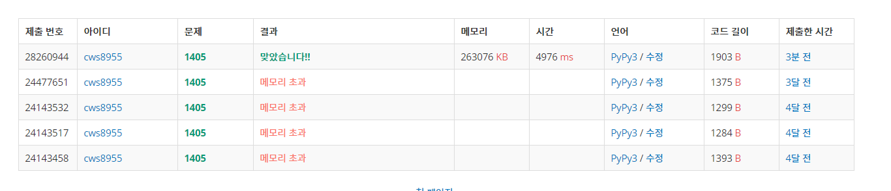

[백준 : 미친 로봇] (https://www.acmicpc.net/problem/1405)


##### 2021.04.11


- 처음에 감을 못잡았지만 아이디어가 생각 난 후로는 쉽게 풀린문제
- stack에 그동안 이동한 방향의 확률을 넣어준다
- 방문안했던 칸들만 방문하면서 움직인 횟수가 주어진 경우와 같은 경우 answer에 값을 더해준다.
- 나머지는 dfs와 똑같다


```python
import sys
sys.stdin = open('1405.txt','r')
sys.setrecursionlimit(10**5)
from copy import deepcopy

def dfs(y,x,move):
    global visit, percent , nn, e,w,s,n,stack,answer

    # print(y,x,move)

    if move > nn:
        return


    value = 1
    for st in stack:
        value *= st
    value = value/(100**move)
    percent[y][x] = deepcopy(value)


    if move == nn:
        answer += value
        # print(y,x,move,stack,answer)
        return

    

    for k in range(4):
        if k == 0:
            if visit[y][x+1] == 0:
                visit[y][x+1] = 1 
                stack.append(e)
                move += 1
                dfs(y,x+1,move)
                visit[y][x+1] = 0
                stack.pop()
                move -= 1
        elif k == 1:
            if visit[y][x-1] == 0:
                visit[y][x-1] = 1
                move += 1
                stack.append(w)
                dfs(y,x-1,move)
                visit[y][x-1] = 0
                stack.pop()
                move -= 1
        elif k == 2:
            if visit[y+1][x] == 0:
                visit[y+1][x] = 1
                move += 1
                stack.append(s)
                dfs(y+1,x,move)
                visit[y+1][x] = 0
                stack.pop()
                move -= 1
        elif k == 3:
            if visit[y-1][x] == 0:
                visit[y-1][x] = 1
                move += 1
                stack.append(n)
                dfs(y-1,x,move)
                visit[y-1][x] = 0
                stack.pop()
                move -= 1
    return

visit = [[0]*29 for _ in range(29)]
percent = [[0]*29 for _ in range(29)]
stack = []

nn,e,w,s,n = map(int, input().split())

answer = 0

visit[14][14] = 2
dfs(14,14,0)

ans = format(answer,".10f")
ans = str(ans)
# print(ans)
ll = len(ans)
answer =''
ss = len(ans)
for k in range(ll-1,-1,-1):
    if ans[k] == '0':
        ss -= 1
    else:
        break

print(ans[0:ss])

```


#### 예전에는 못풀었지만 이제는 풀 수 있다.


