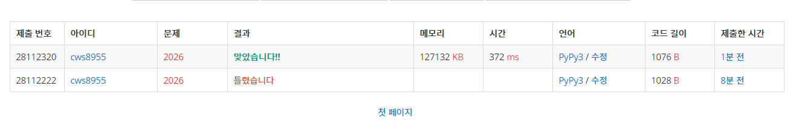

[백준 : 소풍] (https://www.acmicpc.net/problem/2026)


##### 2021.04.07


- 쉬웠던 문제
- 로직
  - 친구관계를 표현하는 이차원배열의 리스트를 만든다.
  - 1부터 순차적으로 dfs를 돌린다.
  - confirm함수는 현재 새로 소풍에 데려가려는 친구가 기존 소풍멤버들 전체와 친구관계인지를 확인하는 함수, 기존 멤버 전체와 친구일 경우 True값을 리턴하며 소풍멤버에 추가한다.
  - 가장 먼저 소풍멤버 수가 문제에 주어진 인원 수와 같아질 경우 final에 소풍멤버 전체를 넣어준다.
  - final의 길이가 0이면 만족하는 소풍멤버 조합이 없다는 걸 의미 , flag를 해주는 이유는 가장 먼저 결성된 소풍멤버 조합이 탄생하면 이후 작업은 무시하기 위해서
  - 0이면 -1 아닐 경우 출력
  - deepcopy는 꼭 쓸 필요는 없음 : 안쓰고도 돌려봤는데 써야할것 같음.....


```python
import sys
sys.stdin = open('2026.txt','r')
from copy import deepcopy

def dfs(now):
    global kk,n,p,arr,visit,answer,flag,final

    

    if len(answer) == kk:
        flag = True
        final = deepcopy(answer)
        return

    for k in range(now,n+1):
        if visit[k] == 0:
            result = confirm(k)
            if result == True and flag == False:
                visit[k] = 1
                answer.append(k)
                dfs(k)
                answer.pop()
                visit[k] = 0

    return

def confirm(now):
    global kk,n,p,arr,visit,answer,flag

    for k in answer:
        if k not in arr[now]:
            return False

    return True
    


kk,n,p = map(int, input().split())
arr = [[] for _ in range(n+1)]
for _ in range(p):
    a,b = map(int,input().split())
    arr[a].append(b)
    arr[b].append(a)

answer = []
visit = [0]*(n+1)
flag = False
final = []

for k in range(1,n+1):
    visit[k] = 1
    answer.append(k)
    dfs(k)
    if flag == True:
        break
    answer.pop()
    visit[k] = 0

if len(final) == 0:
    print(-1)
else:
    for f in final:
        print(f)
```


- 