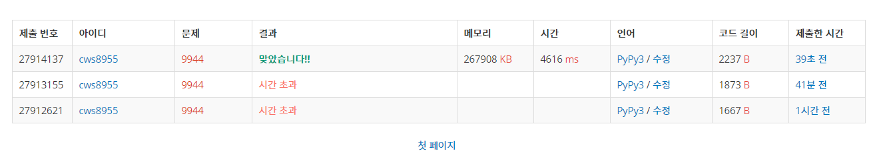

[백준 : NxM 보드 완주하기] (https://www.acmicpc.net/problem/9944)


- 로직
- 일단 '.'인 모든 점에서 시작하는 경우를 전부 탐색해 주어야 한다.
- arr 배열은 문제에서 준 보드의 배열
- visit은 현재 움직인 칸들을 의미, 각 칸의 시작점은 -2, 나머지는 전부 -1 , 그리고 이 후에 몇 번째턴에서 움직였냐에 따라 -1을 depth로 변경
- move함수를 통해 보드를 넘지않고 , 보드가 장애물이 아니고 , 방문했던 칸이 아닐때 까지 쭉 이동
- dfs로 이 과정을 반복하면서 완주시의 최소값을 리턴


- 중요한점
  - reset함수를 쓰지 않고 deepcopy로 그냥 visit을 돌리려고 했는데 그 경우에 시간초과가 많이 발생했다. 그래서 reset이라는 함수를 만들어줬다
  - reset함수의 경우 visit에 있는 수가 파라미터로 받은 depth와 같으면 -1로 원복해준다.


##### 2021.04.01


```python
import sys
sys.stdin = open('9944.txt','r')
sys.setrecursionlimit(10**5)
from copy import deepcopy

def dfs(y,x,depth,cnt):
    global n,m,arr,visit,total,answer

    if cnt == total:
        if depth < answer:
            answer = depth
        return

    if depth >= answer:
        return

    for k in range(4):
        ny,nx,plus_cnt= move(y,x,dy[k],dx[k],depth)
        if plus_cnt == 0:
            continue
        depth += 1
        cnt += plus_cnt
        dfs(ny,nx,depth,cnt)
        depth -= 1
        reset(depth,plus_cnt)
        cnt -= plus_cnt

    return

def move(y,x,dy,dx,depth):
    global n,m,arr,visit,total,answer

    plus = 0
    ny = y
    nx = x
    while True:
        ny += dy
        nx += dx
        if ny<0 or n<=ny or nx<0 or m<=nx or arr[ny][nx] == '*' or visit[ny][nx] != -1:
            ny -= dy
            nx -= dx
            break
        visit[ny][nx] = depth
        plus += 1
    return ny,nx,plus

def reset(depth,plus):
    global n,m,visit

    # print(depth,plus)

    cnt = 0
    for y in range(n):
        stop = False
        for x in range(m):
            if visit[y][x] == depth:
                visit[y][x] = -1
                cnt += 1
            
            if cnt == plus:
                stop = True
                break
        if stop == True:
            break
    return

tc = 1
while True:
    try: 
        dx = [0,0,-1,1]
        dy = [1,-1,0,0]
        n,m = map(int,input().split())
        arr = []
        for _ in range(n):
            arr1 = list(input())
            arr.append(arr1)

        total = 0
        answer = 100000000

        for y in range(n):
            for x in range(m):
                if arr[y][x] == '.':
                    total += 1

        visit = [[-1]*m for _ in range(n)]

        for y in range(n):
            for x in range(m):
                if arr[y][x] == '.':
                    visit[y][x] = -2
                    dfs(y,x,0,1)
                    # print('--------------------------------------------',y,x)
                    visit[y][x] = -1

        # print(answer)
        if answer == 100000000:
            print('Case {}: {}'.format(tc,-1))
        else:
            print('Case {}: {}'.format(tc,answer))
        tc += 1
    except:
        break
```





- 잊지말하야할 중요개념 3
  - move 함수의 개념 + break전에 - 해주는 이유
  - visit을 단순히 True , False가 아니라 각 상황의 depth를 넣어줌으로서 reset에서 복구가 보다 쉬워짐
  - deepcopy는 시간이 엄청 걸린다.