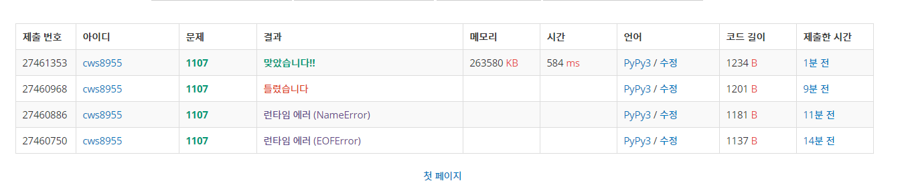

[백준 : 리모컨] (https://www.acmicpc.net/problem/1107)


- 꽤나 애먹은 문제
- 이용가능한 숫자로 만들 수 있는 조합당 타겟채널을 가기위해 필요한 클릭의 횟수가 가장 적은 숫자를 출력한다.
  - 조합으로 이용가능한 숫자와 타겟 채널의 차이 + 조합으로 만들어진 채널의 길이


```python
import sys
sys.stdin = open('1107.txt','r')
from collections import deque
from itertools import *

target = int(input())
n = int(input())
visit = [0]*(1000001)

if n>0:
    lstt = list(map(int ,input().split()))
lst = []

for k in range(10):
    if n>0:
        if k not in lstt:
            lst.append(k)
    else:
        lst.append(k)

# q = deque()
# q.append([0,100])

start = 100000000
len_start = 1000000
compare = 1000000000000
answer = 1000000000
ans_lst = []
a1 = list(product(lst , repeat=1))
a2 = list(product(lst , repeat=2))
a3 = list(product(lst , repeat=3))
a4 = list(product(lst , repeat=4))
a5 = list(product(lst , repeat=5))
a6 = list(product(lst , repeat=6))


ans_lst += a1
ans_lst += a2
ans_lst += a3
ans_lst += a4 
ans_lst += a5
ans_lst += a6

# print(ans_lst)
for a in ans_lst:
    number = ''
    for aa in a:
        number += str(aa)
    # print(number)
    if abs(int(number)) - abs(target) < abs(compare):
        # print('---', int(number))
        # len_start = len(number)
        start = int(number)
        compare = abs(int(number)) - abs(target)
        if abs(compare) + len(number) < answer:
            answer = abs(compare) + len(number)

if abs(abs(100) - abs(target)) < answer:
    answer = abs(abs(100) - abs(target))


print(answer)
```

