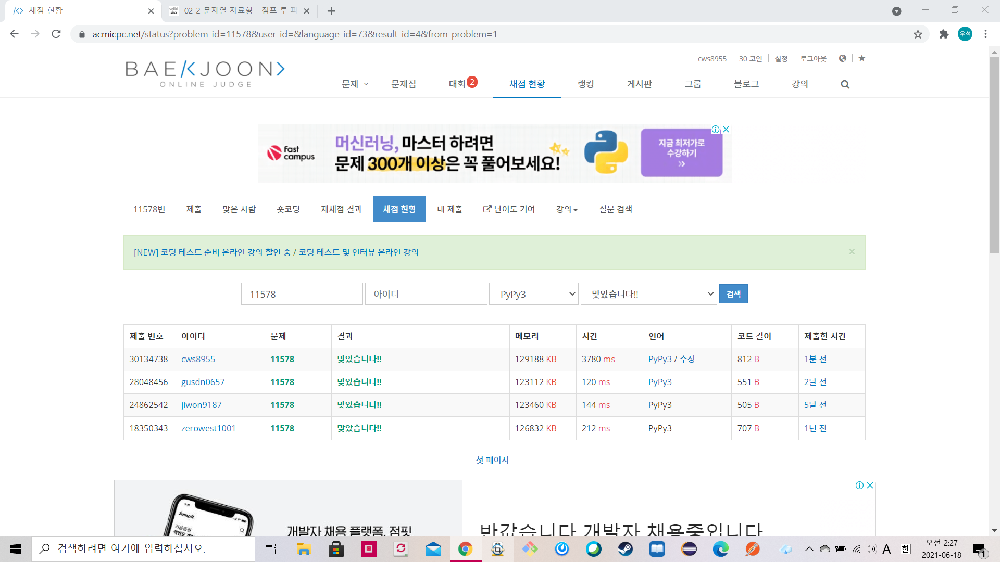

[백준 : 팀원 모집] (https://www.acmicpc.net/problem/11578)


- 내 코드는 시간이 오래걸린다.
- 나중에 효율화 작업을 해야겠다.


```python
import sys
sys.stdin = open('11578.txt','r')

def dfs(student):
    global n,m,students,problems,visit,answer

    if problems.count(0) == 0:
        if answer > student:
            answer = student
        return

    for k in range(1,m+1):
        if visit[k] == 0:
            visit[k] += 1
            for a in students[k]:
                problems[a] += 1
            student += 1
            dfs(student)
            visit[k] -= 1
            student -= 1
            for a in students[k]:
                problems[a] -= 1


    return

n,m = map(int,input().split())

students = []
students.append([])
for _ in range(m):
    arr = list(map(int, input().split()))
    arr = arr[1:]
    students.append(arr)

problems = [1] + [0]*n
visit = [0]*(m+1)
answer = 9876543210
dfs(0)

if answer == 9876543210:
    print(-1)
else:
    print(answer)
```

