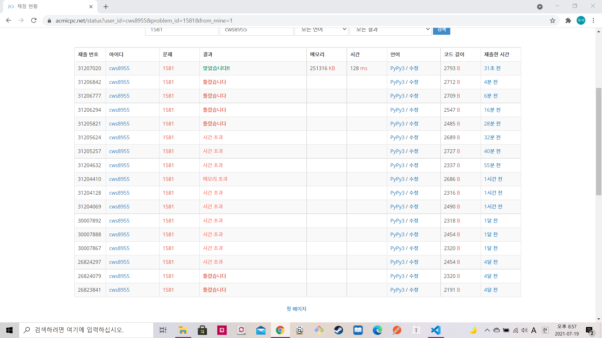

[ 백준: 락스타 락동호 ] (https://www.acmicpc.net/problem/1581)


- 처음에는 모든걸 탐색하는 dfs로 짜서 시간초과가 발생했다.
- 그 후에 시간초과를 해결하기 위해 dfs를 도는 상황들을 모두 분기해 주었다.
- `예를들어 1000 1 0 1000`의 숫자의 경우에는 fs가 하나 있기때문에 ff와 ss를 모두 활용할 수 있다. 그래서 시작과 동시에 ff와 ss를 둘다 0으로 바꾼후 cnt에 2000을 추가해 준다. 이런식으로 시간초과를 극복했다.


```python
import sys
sys.stdin = open('1581.txt','r')
sys.setrecursionlimit(10**5)

def dfs(ff1,fs1,sf1,ss1,cnt,now):
    global answer

    if cnt > answer:
        answer = cnt

    if now == 0:
        for k in range(2):
            if k == 0:
                if ff1 > 0:
                    cnt += 1
                    ff1 -= 1
                    dfs(ff1,fs1,sf1,ss1,cnt,0)
                    cnt -= 1
                    ff1 += 1
            elif k == 1:
                if fs1 > 0:
                    cnt += 1
                    fs1 -= 1
                    dfs(ff1,fs1,sf1,ss1,cnt,1)
                    cnt -= 1
                    fs1 += 1
    elif now == 1:
        for k in range(2):
            if k == 0:
                if sf1> 0:
                    cnt += 1
                    sf1 -= 1
                    dfs(ff1,fs1,sf1,ss1,cnt,2)
                    cnt -= 1
                    sf1 += 1
            elif k == 1:
                if ss1 > 0:
                    cnt += 1
                    ss1 -= 1
                    dfs(ff1,fs1,sf1,ss1,cnt,3)
                    cnt -= 1
                    ss1 += 1
    elif now == 2:
        for k in range(2):
            if k == 0:
                if ff1 > 0:
                    cnt += 1
                    ff1 -= 1
                    dfs(ff1,fs1,sf1,ss1,cnt,0)
                    cnt -= 1
                    ff1 += 1
            elif k == 1:
                if fs1 > 0:
                    cnt += 1
                    fs1 -= 1
                    dfs(ff1,fs1,sf1,ss1,cnt,1)
                    cnt -= 1
                    fs1 += 1
    elif now == 3:
        for k in range(2):
            if k == 0:
                if sf1> 0:
                    cnt += 1
                    sf1 -= 1
                    dfs(ff1,fs1,sf1,ss1,cnt,2)
                    cnt -= 1
                    sf1 += 1
            elif k == 1:
                if ss1 > 0:
                    cnt += 1
                    ss1 -= 1
                    dfs(ff1,fs1,sf1,ss1,cnt,3)
                    cnt -= 1
                    ss1 += 1


    return


ff,fs,sf,ss = map(int, input().split())

answer = 0

if ff == 0 and fs ==0:
    if sf == 0 and ss != 0:
        print(ss)
    elif sf != 0 and ss == 0:
        print(1)
    elif sf != 0 and ss != 0:
        print(ss+1)        
else:
    if ff >0:
        ll = min(fs,sf)-1
        if fs > 0 and sf > 0:
            dfs(0,fs-ll,sf-ll,0,(ll*2)+ff+ss,0)
        elif fs == 0 and sf >0:
            dfs(0,0,sf,ss,ff,0)
        elif sf == 0 and fs >0:
            dfs(0,fs,0,0,ff+ss,0)
        elif sf == 0 and fs ==0:
            dfs(0,0,0,0,ff,0)
    elif fs>0:
        ll = min(fs,sf)-1
        if  sf > 0:
            dfs(0,fs-ll-1,sf-ll,0,(ll*2)+1+ff+ss,1)
        elif sf == 0:
            dfs(0,fs-1,0,0,ff+ss+1,1)

    print(answer)
```

