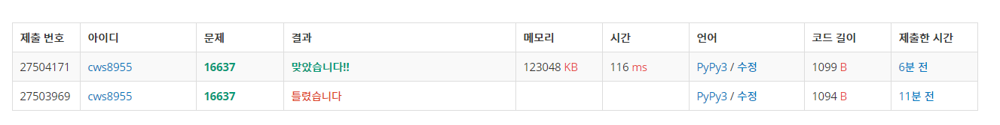

[백준 : 괄호 추가하기] (https://www.acmicpc.net/problem/16637)


- 이번 문제는 도저히 아이디어가 생각이 나지 않아서 해답 코드를 참고하여 풀었습니다. (백준 온라인 강의 과거에 듣던거 다시 들어봄)
- 1. 비트마스킹의 활용
- 2. 아이디어 -> 숫자가 아닌 연산자를 중심으로 생각하기
  3. 미리 연산하는 연산자로 선택된 경우 미리 값을 구해서  앞에 넣고 연산자는 +로 뒤의 수는 0으로 바꾸기
- 굉장히 참신한 방법인 것 같다. 
- 다른 사람 코드를 참고한 적이 진짜 오랜만인데 오늘의 참고는 굉장히 만족한다. 새로운 방법을 배운 것 같다


```python
import sys
sys.stdin = open('16637.txt','r')

n = int(input())
arr = list(input())
answer = None

for i in range(0,len(arr),2):
    arr[i] = int(arr[i])

m = (n-1)//2

for k in range(1<<m):

    ok = True
    for s in range(m-1):
        if (k&(1<<s)) > 0 and (k&(1<<(s+1))) >0:
            ok = False

    if ok == False:
        continue

    brr = arr[:]
    for s in range(m):
        if (k&(1<<s)) > 0:
            mm = 2*s+1
            if brr[mm] == '+':
                brr[mm-1] += brr[mm+1]
                brr[mm+1] = 0
            if brr[mm] == '*':
                brr[mm-1] *= brr[mm+1]
                brr[mm] = '+'
                brr[mm+1] = 0
            if brr[mm] == '-':
                brr[mm-1] -= brr[mm+1]
                brr[mm] = '+'
                brr[mm+1] = 0
    temp = brr[0]
    for s in range(m):
        mm = 2*s+1
        if brr[mm] == '+':
            temp += brr[mm+1]
        if brr[mm] == '-':
            temp -= brr[mm+1]
        if brr[mm] == '*':
            temp *= brr[mm+1]

    # print(temp)

    if answer is None:
        answer = temp
    if answer < temp:
        answer = temp

print(answer)

```

