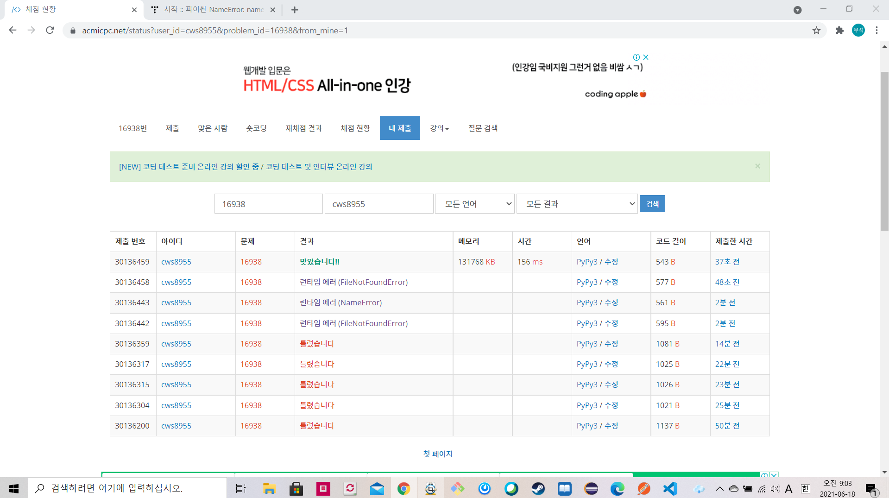

[백준 : 캠프 준비] (https://www.acmicpc.net/problem/16938)


- 생각보다 해매서 당황했던 문제
- dp도 써보고 , dfs도 써보고 했는데 코드가 자꾸 에러나서 다시 생각해보니 조합을 쓰면 쉽게 풀릴 것 같아서 조합을 써보니 정말 쉽게 풀림


```python
import itertools
import sys
sys.stdin = open('16938.txt','r')

n,l,r,x = map(int, input().split())
arr = list(map(int,input().split()))

brr = [i for i in range(n)]

crr = []
for k in range(1,n+1):
    a = list(itertools.combinations(brr,k))
    crr += a

crr = set(crr)

answer = 0

for cr in crr:
    _sum = 0
    left = arr[cr[0]]
    right = arr[cr[0]]
    for c in cr:
        _sum += arr[c]
        if left > arr[c]:
            left = arr[c]
        if right < arr[c]:
            right = arr[c]
    if l<=_sum<=r and right - left >=x:
        answer += 1

print(answer)
```

