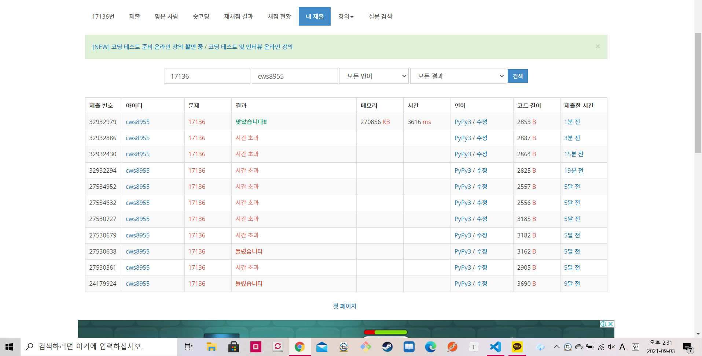

[ 백준 : 색종이 붙이기 ] (https://www.acmicpc.net/problem/17136)


- 과거에 손도 못댔던 문제다.
- 이제는 풀었다!!!!!


- 10*10칸의 보드를 순회하는 dfs함수
- 색종이를 붙여야할 칸을 마주칠 경우 각 크기별 색종이를 붙여주는 check함수
- 원상 복구 시켜주는 check함수


- 백트래킹을 안해줘서 시간초과가 났었다.
- if paper >= answer: return 코드를 통해 백트래킹을 실행시켜줬다.


```python
import sys
sys.stdin = open('17136.txt','r')
sys.setrecursionlimit(10**5)

def dfs(yy,xx):
    global remain,visit,arr,global_flag,point,cnt,answer,paper
    # print(yy,xx)

    # print(yy,xx,cnt)

    if point == cnt:
        if answer > paper:
            answer = paper
        return

    if paper >= answer:
        return


    for y in range(yy,10):
        flagg = True
        for x in range(0,10):
            flag = True
            if arr[y][x] == 1 and visit[y][x] == 0:
                for k in range(1,6):
                    if remain[k] > 0:
                        result = check(y,x,k)
                        if result == True:
                            remain[k] -= 1
                            dfs(y,x)
                            remain[k] += 1
                            restore(y,x,k)
                        if result == False:
                            flag = False
                            break
            if flag == False:
                flagg = False
                break
        if flagg == False:
            break

    return

def check(y,x,k):
    global remain,visit,arr,global_flag,point,cnt,answer,paper

    flag = True
    temp = []
    if y+k-1 < 10 and x+k-1<10:
        for yy in range(y,y+k):
            flag = True
            for xx in range(x,x+k):
                if visit[yy][xx] == 0 and arr[yy][xx] == 1:
                    temp.append([yy,xx])
                else:
                    flag = False
                    temp = []
                    break
            if flag == False:
                break
    else:
        return False

    if flag == False:
        return False
    else:
        for tmp in temp:
            visit[tmp[0]][tmp[1]] = 1
            cnt += 1
        paper += 1
    return True

def restore(y,x,k):
    global remain,visit,arr,global_flag,point,cnt,answer,paper

    flag = True
    temp = []
    if y+k-1 < 10 and x+k-1<10:
        for yy in range(y,y+k):
            flag = True
            for xx in range(x,x+k):
                if visit[yy][xx] == 1 and arr[yy][xx] == 1:
                    temp.append([yy,xx])
                else:
                    flag = False
                    temp = []
                    break
            if flag == False:
                break
    else:
        return False

    if flag == False:
        return False
    else:
        for tmp in temp:
            visit[tmp[0]][tmp[1]] = 0
            cnt -= 1
        paper -= 1
    return True

                

remain = [5]*6
visit  = [[0]*10 for _ in range(10)]
arr = []
global_flag = True
for _ in range(10):
    ar = list(map(int, input().split()))
    arr.append(ar)

point = 0
cnt = 0
paper = 0
answer = float('inf')
for y in range(10):
    for x in range(10):
        if arr[y][x] == 1:
            point += 1    

dfs(0,0)

if answer == float('inf'):
    print(-1)
else:
    print(answer)
```

