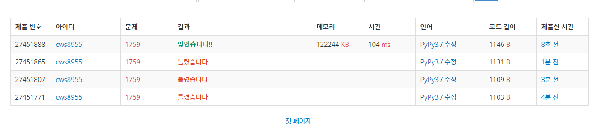

[백준 : 암호만들기] (https://www.acmicpc.net/problem/1759)


- 쉬운 조합을 활용한 브루투포스 문제

- 다만 조심해야할 점이 있다. 100%에서 자꾸 틀렸는데 

  - ```python
    if n == 3:
        divides.append((1,2))
    ```

  -  그 이유는 l이 3인 경우에는 기존 코드가 무시했기 때문이였다. 그래서 길이가 3인 경우에만 강제로 if 문을 통해서 값을 넣어줬다.


2021.03.19


```python
import sys
sys.stdin = open('1759.txt','r')
from itertools import *

def make(moo,jaa):
    global n,m,mo_lst,ja_lst,answer_lst

    all_lst = moo + jaa
    # print(all_lst)

    all_lst = sorted(all_lst, key=lambda x:x)
    
    string = ''
    for al in all_lst:
        string += al

    answer_lst.add(string)
    return

n,m = map(int, input().split())

mo_lst = []
ja_lst = []

compare = ['a','e','i','o','u']

lst = list(input().split())

for ls in lst:
    if ls in compare:
        mo_lst.append(ls)
    else:
        ja_lst.append(ls)

answer_lst = set()

divides = []

max_n = n-3
for k in range(max_n):
    divides.append((k+1,max_n-k+2))
    divides.append((max_n-k+1,k+2))

divides = set(divides)
divides = list(divides)
if n == 3:
    divides.append((1,2))
# print(mo_lst, ja_lst)
# print(divides)

for divide in divides:
    if divide[0] <= len(mo_lst) and divide[1] <= len(ja_lst):
        # print(divide)
        mo = list(combinations(mo_lst , divide[0]))
        ja = list(combinations(ja_lst , divide[1]))
        for m in mo:
            for j in ja:
                make(m,j)

answer_lst = sorted(answer_lst, key = lambda x:x)

for ans in answer_lst:
    print(ans)


```

