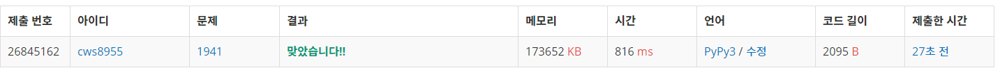

[백준 - 소문난 칠공주] (https://www.acmicpc.net/problem/1941)


###### 1. 다솜파 4명인경우, 도연파 3명인 경우 / 다솜파 5명인 경우, 도연파 2명인 경우 / 다솜판 6명인 경우 도연파 1명인 경우 / 다솜파 7명인 경우 를 각각 구한다

###### 2. 그 후 각 경우가 연결되어 있는지 확인, 연결되어 있을 경우 값에 1추가.


```python
import sys
sys.stdin = open('1941.txt','r')
sys.setrecursionlimit(10**5)
from itertools import *
from collections import deque

def plus(se):
    global n,arr,visit,seven,seee

    for s in se:
        visit[s[0]][s[1]] = 1

    q = deque()
    q.append([se[0][0],se[0][1]])
    visit[se[0][0]][se[0][1]] = 0

    # print(se)
    # print(se[0][0],se[0][1])
    cnt = 1 
    while q:
        y,x = q.popleft()

        for k in range(4):
            ny = y+dy[k]
            nx = x+dx[k]
            if 0<=ny<n and 0<=nx<n:
                if visit[ny][nx] == 1:
                    # print('---')
                    visit[ny][nx] = 0
                    if [ny,nx] in se:
                        cnt += 1
                        # print(y,x,cnt)
                        q.append([ny,nx])

    if cnt == 7:
        seven += 1
        # seee.append(se)

        # lst = sorted(se, key = lambda x : (x[0], x[1]))
        # print(lst)
        # if lst not in se:
        #     seven += 1

    return

dy = [0,0,1,-1]
dx = [1,-1,0,0]
n = 5
arr = []
for _ in range(n):
    arr1 = list(input())
    arr.append(arr1)

dasoms = []
doyeons = []

seven = 0
seee = []
visit = [[0]*n for _ in range(n)]

for y in range(n):
    for x in range(n):
        if arr[y][x] == 'S':
            dasoms.append([y,x])
        if arr[y][x] == 'Y':
            doyeons.append([y,x])

dasoms4 = list(combinations(dasoms,4))
doyeons3 = list(combinations(doyeons,3))

dasoms5 = list(combinations(dasoms,5))
doyeons2 = list(combinations(doyeons,2))

dasoms6 = list(combinations(dasoms,6))
doyeons1 = list(combinations(doyeons,1))

dasoms7 = list(combinations(dasoms,7))

for da in dasoms4:
    for do in doyeons3:
        se = da+do
        # print(se)
        plus(se)
        visit = [[0]*n for _ in range(n)]

for da in dasoms5:
    for do in doyeons2:
        se = da+do
        # print(se)
        plus(se)
        visit = [[0]*n for _ in range(n)]

for da in dasoms6:
    for do in doyeons1:
        se = da+do
        # print(se)
        plus(se)
        visit = [[0]*n for _ in range(n)]

for da in dasoms7:
    # print(se)
    plus(da)
    visit = [[0]*n for _ in range(n)]

print(seven)
# print(seee)
```


###### 조합을 재귀로 짜는 코드를 예전에 익혔었는데 까먹은것 같다. itertools를 안쓰고 조합과 순열을 뽑아내는 코드를 복습해야 겠다.





###### 이번에 1회만에 성공!!!!!!!!