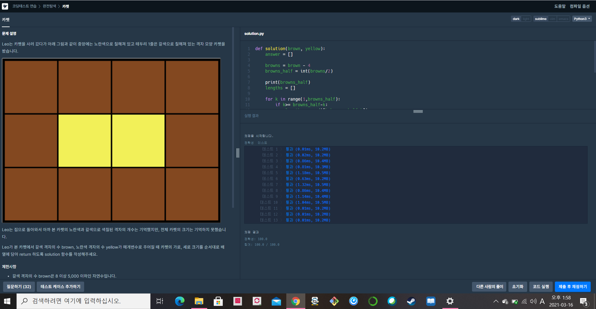

[프로그래머스 : 카펫] (https://programmers.co.kr/learn/courses/30/lessons/42842)


- 처음에 5분정도 헤매였지만 방법을 생각하고 나니 바로 푼 문제 
- 로직
- 먼저 브라운의 경우의 수를 구해준다 우측 상단 , 우측 하단 , 좌측 상단 , 좌측 하단을 제외하고 남은 갈색 타일로 만들 수 있는 가로와 세로의 쌍을 만들어준다. (각각 2개이므로 절반의 양으로만 만들어 준다)
- 만들어진 쌍을 활용해 최종 갈색 리스트를 출력한다.
- 갈색 리스트가 만들어지고 나면 갈색의 가로 -2 * 세로 -2 의 양과 yellow가 같은지 확인한다.


```python
def solution(brown, yellow):
    answer = []
    
    browns = brown - 4
    browns_half = int(browns/2)
    
    print(browns_half)
    lengths = []
    
    for k in range(1,browns_half):
        if k>= browns_half-k:
            lengths.append([k,browns_half-k])
    
    lst = []
    for length in lengths:
        lst.append([length[0]+2, length[1]+2])
        
    for ls in lst:
        if (ls[0]-2) * (ls[1]-2) ==  yellow:
            answer.append([ls])
            break
    
    # print(answer)
    return answer[0][0]
```

