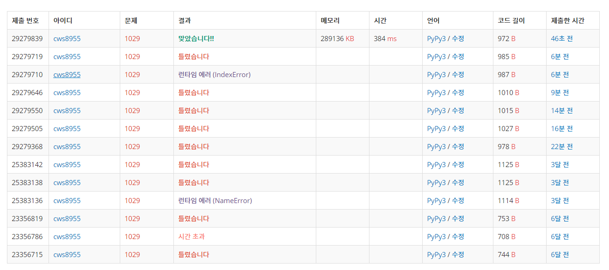

[백준 : 그림교환] (https://www.acmicpc.net/problem/1029)


- 외판원 순회 문제의 활용버전 문제


```python
import sys
sys.stdin = open('1029.txt','r')
sys.setrecursionlimit(10**5)

def dfs(now,price,visit):
    global n,arr,INF,dp,max_price,answer

    result = 0
    for k in range(n):
        if visit&(1<<k):
            result += 1
    
    if result > answer:
        answer = result

    if dp[price][now][visit] != INF:
        return dp[price][now][visit]

    for nxt in range(n):
        if now != nxt:
            nxt_price = arr[now][nxt]
            if not visit&(1<<nxt) and arr[now][nxt] >= price:
                nxt_visit = visit|(1<<nxt)
                dp[price][now][visit] = 1
                dfs(nxt,arr[now][nxt],nxt_visit)


    return


n = int(input())
arr = []
for _ in range(n):
    arr1 = list(map(int, input()))
    arr.append(arr1)

INF = sys.maxsize

dp = [[[INF]*(1<<(n)) for _ in range(n)]for _ in range(10)]

max_price = 0

for y in range(n):
    for x in range(n):
        if arr[y][x] > max_price:
            max_price = arr[y][x]

answer = 0
dfs(0,0,(1<<0))

print(answer)
# print(dp)
# print(arr)
```

