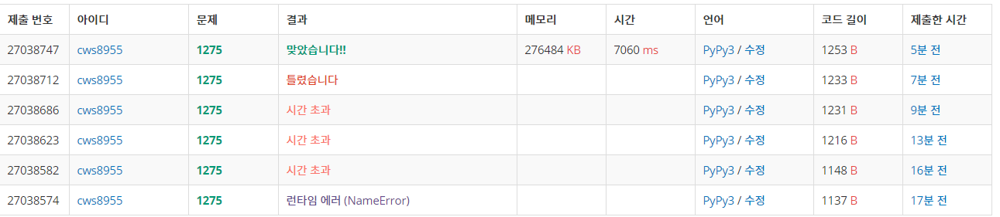

[백준 - 1275 : 커피숍2] (https://www.acmicpc.net/problem/1275)


### 처음 풀어본 세그먼트 트리 문제

###### 알고리즘을 검색한 후 공부를 하고 처음 문제를 풀어보았다.


```python
import sys
sys.stdin = open('1275.txt','r')
sys.setrecursionlimit(10**5)

def init(node,start,end):
    global n,q,arr,tree

    if start == end:
        tree[node] = arr[start]
        return tree[node]
    else:
        tree[node] = init(node*2,start,(start+end)//2) + init(node*2+1, (start+end)//2 + 1 , end)
        return tree[node]

def subsum(node,start,end,left,right):
    global n,q,arr,tree

    if right<start or end<left:
        return 0

    if left<=start and end<=right:
        return tree[node]

    return subsum(node*2,start,(start+end)//2,left,right) + subsum(node*2+1, (start+end)//2 +1 , end, left, right)

def change(node,start,end,index,diff):
    global n,q,arr,tree

    if index<start or end<index:
        return 0

    tree[node] += diff

    if start != end:
        change(node*2 , start, (start+end)//2, index, diff)
        change(node*2+1, (start+end)//2 + 1 , end, index , diff)

    return


n , q = map(int, input().split())
arr = list(map(int, input().split()))
tree = [0]*(n*4)

init(1,0,n-1)

for _ in range(q):
    s,e,a,b = map(int, input().split())
    if s<=e:
        answer = subsum(1,0,n-1,s-1,e-1)
    else:
        answer = subsum(1,0,n-1,e-1,s-1)
    print(answer)
    diff = b - arr[a-1]
    arr[a-1] = b
    change(1,0,n-1,a-1,diff)
```


### 굉장히 재밌게 풀었다.


###### 근데 코드 효율성이..... 원래 이런건가... 내 코드가 이상한건가





아래의 사진은 세그먼트 트리를 공부한 사진이다.


