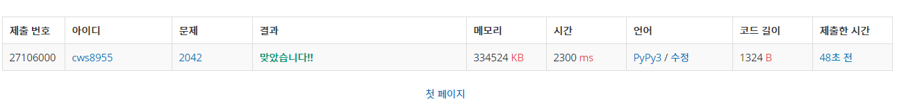

[백준 2042 : 구간 합 구하기] (https://www.acmicpc.net/problem/2042)


### 기본적인 segment tree 문제

- 합에 대한 기본적인 세그먼트 트리는 이제 어느정도 알겠는데, 곱이나 활용에서는 어떠할지 떨린다..... 어려워질것 같다 ㅠㅠ


2021.03.09


```python
import sys
sys.stdin = open('2042.txt','r')
sys.setrecursionlimit(10**5)

def init(node,start,end):
    global arr,tree

    if start == end:
        tree[node] = arr[start]
        return tree[node]
    else:
        tree[node] =  init(node*2, start, (start+end)//2) + init(node*2 +1 , (start+end)//2 +1 , end)
        return tree[node]

    return

def submultiple(node,start,end,left,right):
    global arr,tree

    if end<left or right<start:
        return 0

    if left<=start and end<=right:
        return tree[node]

    return submultiple(node*2, start, (start+end)//2 , left, right) + submultiple(node*2 +1 , (start+end)//2 +1 , end ,left,right)

def change(node,start,end,index,diff):
    global arr, tree

    if index < start or end < index:
        return 0

    tree[node] += diff

    if start != end:
        change(node*2, start, (start+end)//2 , index, diff)
        change(node*2 +1 , (start+end)//2 +1 ,end ,index, diff)

    return

n,s,c = map(int, input().split())
arr = []
for _ in range(n):
    a = int(input())
    arr.append(a)

tree = [0]*(n*4)

init(1,0,n-1)

# print(tree)
for _ in range(s+c):
    a,b,c = map(int, input().split())
    if a == 2: 
        ans = submultiple(1,0,n-1,b-1,c-1)
        print(ans)
    else:
        diff = c- arr[b-1]
        arr[b-1] = c
        # print(b-1,c)
        change(1,0,n-1,b-1,diff)
    # print(tree)

# print(tree)
```


