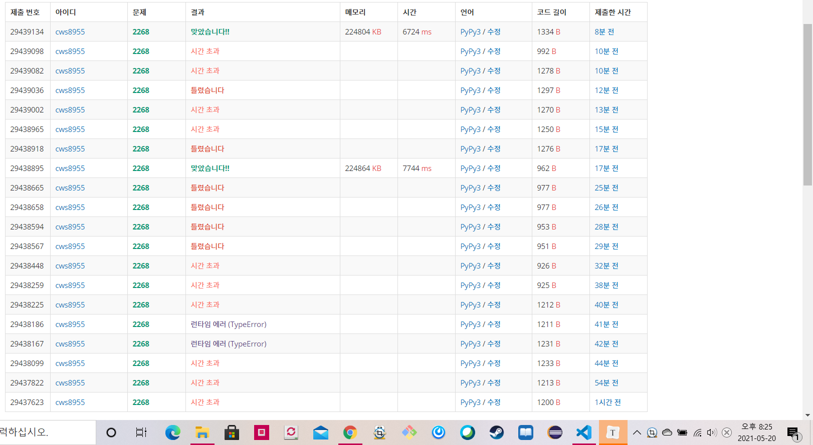

[백준 : 수들의 합] (https://www.acmicpc.net/problem/2268)

- 되게 고생 많이 했던 문제
- 일반적인 세그먼트 트리와 같은 문제지만 주의할 점이 존재한다.
  - 처음에 모든 원소가 0이라고 언급했기 때문에 init을 할 필요가 없다
  - 합의 구간이 거꾸로 들어올 경우에는 두 수를바꿔줘야한다
  - ..... 후...


```python
import sys
# sys.stdin = open('2268.txt','r')
# sys.setrecursionlimit(10**5)
input = sys.stdin.readline

# def init(node,start,end):
#     global arr,tree

#     if start == end:
#         tree[node] = arr[start]
#         return tree[node]
#     else:
#         tree[node] = init(node*2,start,(start+end)//2) + init(node*2+1, (start+end)//2 + 1 , end)
#         return tree[node]

#     return

def subsum(node,start,end,left,right):
    global n,m,arr,tree

    if right<start or end<left:
        return 0

    if left<=start and end<=right:
        return tree[node]

    return subsum(node*2,start,(start+end)//2,left,right) + subsum(node*2+1, (start+end)//2 +1 , end, left, right)

def modify(node,start,end,index,diff):
    global n,m,arr,tree

    if index < start or end < index:
        return 0

    tree[node] += diff

    if start != end:
        modify(node*2, start, (start+end)//2 ,index, diff)
        modify(node*2+1, (start+end)// 2 + 1 , end, index ,diff)

    return 

n,m = map(int, input().split())
arr = [0]*(n+1)
tree = [0]*(n*4)

# init(1,0,n-1)
for k in range(m):
    a,b,c = map(int, input().split())
    if a == 0:
        if b>c:
            b,c = c,b
        ans = subsum(1,0,n-1,b-1,c-1)
        print(ans)
    if a== 1:
        diff = c - arr[b-1]
        arr[b-1] = c
        modify(1,0,n-1,b-1,diff)

```

