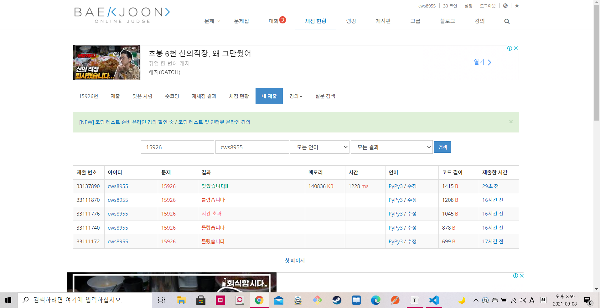

[ 백준 : 현욱은 괄호왕이야 ] (https://www.acmicpc.net/problem/15926)


- 새벽에는 졸려서 못풀었던 문항인데 맨정신에 푸니까 생각보다 쉽게 풀렸다
- 뭔가 스택문제인데 스택 + 큐의 두가지 개념을 혼합해서 풀었다. 내 풀이가 정석적인 풀이는 아닐 것 같다


```python
import sys
sys.stdin = open('15926.txt','r')
from collections import deque

n = int(input())
string = list(input())
stack = deque()
left = 0
cnt = 0
stack2 = deque()


idx = 0
while idx<n:
    now = string[idx]
    if len(stack) == 0:
        if now == '(':
            stack.append('(')
            stack2.append('(')
            left += 1
    else:
        if now == '(':
            stack.append('(')
            stack2.append('(')
            left += 1
        else:
            if left >0 :
                stack.popleft()
                stack.append(2)
                stack2.append(2)
                left -= 1
            else:
                stack2.append(')')
                stack = deque()


    idx += 1


stack2.reverse()
cnt = 0
for s in range(len(stack2)):
    if cnt == 0:
        if stack2[s] == 2:
            cnt += 1
    else:
        if stack2[s] == ')':
            cnt = 0
        elif stack2[s] == 2:
            cnt += 1
        else:
            if cnt >0:
                stack2[s] = '-'
                cnt -= 1
            else:
                pass

cnt = 0
answer = 0

for s in stack2:
    if cnt == 0:
        if s == 2:
            cnt += 2
            if cnt > answer:
                answer = cnt
    else:
        if s == ')':
            cnt = 0
        elif s == 2:
            cnt += 2
            if cnt > answer:
                answer = cnt
        elif s == '(':
            cnt = 0

print(answer)

    
```

