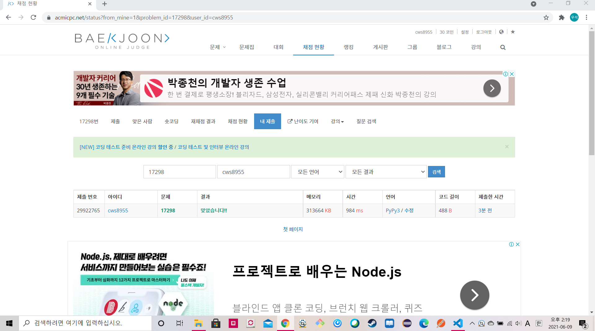

[백준 : 오큰수] (https://www.acmicpc.net/problem/17298)


- 일반적인 스택문제이다.

- stack에 저장할때 위치와 숫자를 같이 저장한다는게 핵심

- ```python
  import sys
  sys.stdin = open('17298.txt','r')
  
  n = int(input())
  S = list(map(int, input().split()))
  stack = []
  answer = [-1]*n
  
  for s in range(len(S)):
      if len(stack) == 0:
          stack.append([s,S[s]])
      else:
          if stack[-1][1] >= S[s]:
              stack.append([s,S[s]])
          else:
              c = -1
              while len(stack) > 0 and stack[c][1] < S[s]:
                  a,b = stack.pop()
                  answer[a] = S[s]
              stack.append([s,S[s]])
  
  for ans in answer:
      print(ans , end= ' ')
  
  ```

  


