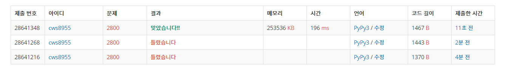

[백준 : 괄호 제거] (https://www.acmicpc.net/problem/2800)


##### 2021.04.23


- 로직
- 재귀로도 풀 수 있을 것 같았지만 최대 괄호쌍의 개수가 1 ~ 10개 사이라는 점과 올바른 괄호쌍들만 있다는 점을 문제에서 파악한 후 그냥 여는괄호와 닫는 괄호 짝의 번호를 쌍으로 해서 리스트에 저장하고 이를 조합으로 전부 돌렸다.
- 그 후 괄호를 1개 제거부터 최대 개수 제거 까지 모든 경우의 수를 제거해준 애들을 answers라는 곳에 저장 후 set을 이용해 중복을 제거한 후 출력해준다.


```python
import sys
sys.stdin = open('2800.txt','r')
sys.setrecursionlimit(10**5)
from collections import deque
from itertools import *
from copy import deepcopy


lstt = list(input())

lst = deque()
for ls in lstt:
    lst.append(ls)

delete_lst = []
left = deque()
answer= []

cnt = 0
while lst:
    now = lst.popleft()
    if now == '(':
        left.append(cnt)
    elif now == ')':
        k = left.pop()
        delete_lst.append([k,cnt])

    cnt += 1

ll = len(delete_lst)

lst1 = list(combinations(delete_lst,1))
lst2 = list(combinations(delete_lst,2))
lst3 = list(combinations(delete_lst,3))
lst4 = list(combinations(delete_lst,4))
lst5 = list(combinations(delete_lst,5))
lst6 = list(combinations(delete_lst,6))
lst7 = list(combinations(delete_lst,7))
lst8 = list(combinations(delete_lst,8))
lst9 = list(combinations(delete_lst,9))
lst10 = list(combinations(delete_lst,10))
a_lst = []
a_lst += lst1
a_lst += lst2
a_lst += lst3
a_lst += lst4
a_lst += lst5
a_lst += lst6
a_lst += lst7
a_lst += lst8
a_lst += lst9
a_lst += lst10


# print(a_lst)

while a_lst:
    k = a_lst.pop()
    delete = []
    for kk in k:
        for kkk in kk:
            delete.append(kkk)

    answer.append(delete)

# print(answer)

temp = deepcopy(lstt)
# print(temp)
answers = set()

string = ''
for ans in answer:
    for tmp in range(len(temp)):
        if tmp not in ans:
            string += temp[tmp]
    answers.add(string)
    string = ''

answers = list(answers)
answers.sort()
for ans in answers:
    print(ans)
```




