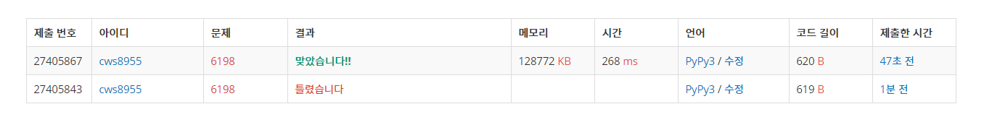

[백준 : 옥상정원 꾸미기] (https://www.acmicpc.net/problem/6198)


- 로직
- 스택을 활용한 문제이다.
- 새로 스택에 빌딩이 추가될때 자신보다 큰경우를 만나기 전까지 계속 stack에서 이전 빌딩들을 pop한다. 스택이 빌 경우 자신을 추가해주고, 중간에 자신보다 큰애 만날 경우에도 pop을 그만해주고 자신을 추가해준다.

2021.03.18


```python
import sys
sys.stdin = open('6198.txt','r')
from collections import deque

n = int(input())

stack = deque()

answer = 0

for _ in range(n):
    new = int(input())
    # print(new)
    if len(stack) == 0:
        stack.append(new)
    else:
        ll = len(stack)
        # if ll == 1:
        #     ll = 2
        for k in range(ll-1,-1,-1):
            if stack[k] <= new:
                stack.pop()
                if len(stack) == 0:
                    stack.append(new)
            else:
                # print(stack)
                answer+=len(stack) # 나를 볼 수 있는 왼쪽에 있는 빌딩의 개수를 지속적으로 더해준다
                stack.append(new)
                break
    
    # print('----',stack)


print(answer)

```

