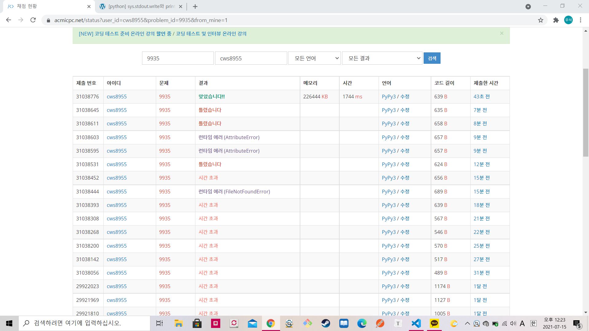

[백준 : 문자열 폭발] (https://www.acmicpc.net/problem/9935)


- sys.stdout.write 즉 출력과정에서 시간초과가 발생했던 문제
- 일반적인 스택문제와 유사하다
- 스택에 arr에서 하나씩 빼서 넣은 후
- 폭발 문자열보다 현재 스택의 길이가 긴 경우 끝에서 부터 폭발문자열 만큼 길이의 스택이 폭발문자열과 같은지 확인하는 과정
- 같을 경우 폭발 문자열을 다시 안넣어주고 다를 경우 다시 넣어준다.


```python
import sys
sys.stdin = open('9935.txt','r')
from collections import deque

arr = list(input())
arr = deque(arr)
bomb = list(input())
bomb = deque(bomb)
stack = deque()
ll = len(arr)
ls = len(bomb)
answer = ''

cnt = 0
l = 0
while cnt < ll:
    now = arr.popleft()
    stack.append(now)
    l += 1

    if  l>= ls:
        compare = deque()
        c = 0
        while c < ls:
            s = stack.pop()
            c += 1
            l -= 1
            compare.appendleft(s)

        if compare != bomb:
            stack += compare
            l += ls
    


    cnt += 1
    

if len(stack) == 0:
    print('FRULA')
else:
    for s in stack:
        sys.stdout.write(s)
```

