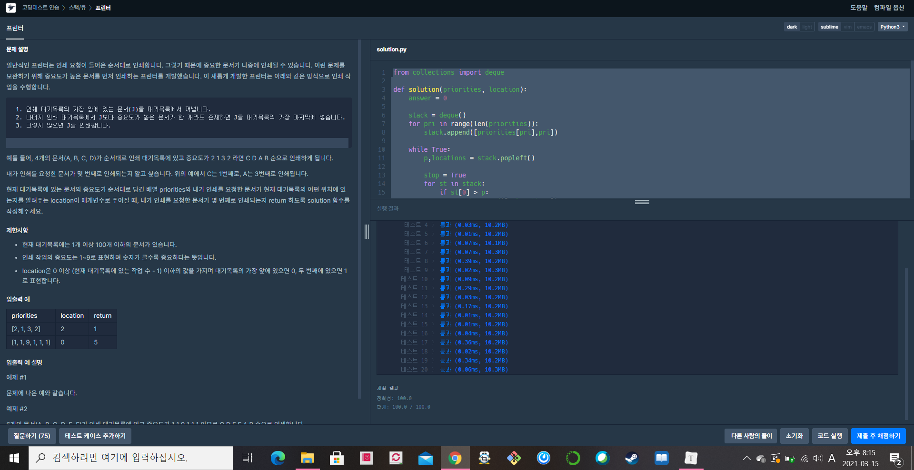

[프로그래머스  : 프린터] (https://programmers.co.kr/learn/courses/30/lessons/42587)


- 너무 쉬운 스택 문제 (15분정도 걸린거 같다.... 왤케 오래걸렸지)
- 처음에 stack이라는 deque에 값과 위치를 쌍으로 하는 리스트를 넣음
- while 문을 통해  popleft를 해서 값과 위치를 가져옴
- 값을 남아있는 스택의 값들과 비교했을때 남아있는 스택의 값중 하나만이라도 popleft해서 얻은 값보다 크다면 다시 popleft했던 애는 다시 stack에 넣어줌
- stop의 경우 다 돌았는데도 p가 st[0]보다 크다는 것을 의미함으로 프린터에서 출력해준다. answer에 하나 추가하면 locations값이 location과 같다면 내가 알고자하는 값이므로 거기까지만 answer에 더해주고 break


```python
from collections import deque

def solution(priorities, location):
    answer = 0
    
    stack = deque()
    for pri in range(len(priorities)):
        stack.append([priorities[pri],pri])
    
    while True:
        p,locations = stack.popleft()
        
        stop = True
        for st in stack:
            if st[0] > p:
                stack.append([p,locations])
                stop = False
                break
                
        if stop == True:
            answer += 1
            if locations == location:
                break
            
    #print(answer)
    return answer
```

