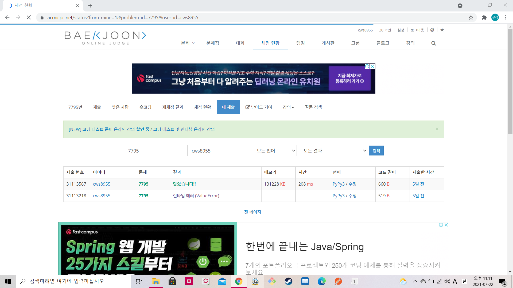

[ 백준 : 먹을 것인가 먹힐 것인가 ] (https://www.acmicpc.net/problem/7795)


- 면접보고 와서 예전에 풀고 푸쉬안했던 문제를 푸쉬함


```python
import sys
sys.stdin = open('7795.txt','r')

def binary(pos):
    global n,m,arr,brr,answer

    L = 0
    R = len(brr)-1
    result = 0

    while L <= R:
        M = (L+R)//2

        if brr[M] >= pos:
            R = M-1
        else:
            result = M+1
            L = M+1
            
    return result

t = int(input())
for tc in range(t):
    n,m = map(int, input().split())
    arr = list(map(int, input().split()))
    brr = list(map(int, input().split()))

    arr.sort()
    brr.sort()
    lla = len(arr)

    cnt = 0
    answer = 0
    while cnt < lla:

        result = binary(arr[cnt])
        answer += result
        cnt += 1

    print(answer)

```

