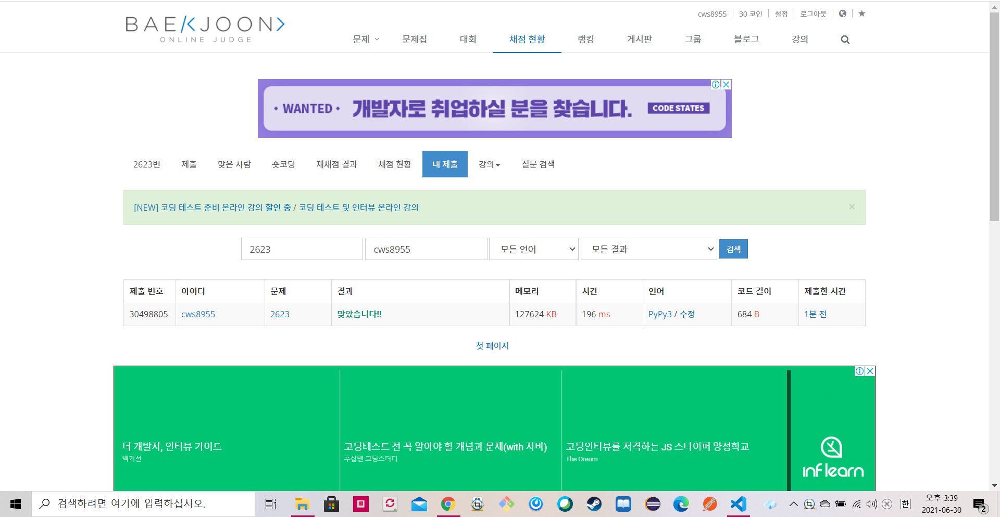

[2623 : 음악 프로그램] (https://www.acmicpc.net/problem/2623)


- 위상정렬 공부 후 처음 풀어본 문제
- 처음이라 그런지 뭔가 아직 많이 어색하다......


```python
import sys
sys.stdin = open('2623.txt','r')
from collections import deque

n,m = map(int, input().split())
arr = [[] for _ in range(n+1)]
indegree = [0]*(n+1)

for _ in range(m):
    ar = list(map(int, input().split()))
    l = len(ar)
    for k in range(1,l-1):
        arr[ar[k]].append(ar[k+1])
        indegree[ar[k+1]] += 1

queue = deque()

for k in range(1,n+1):
    if indegree[k] == 0:
        queue.append(k)

answer = []
while queue:
    s = queue.popleft()

    for nxt in arr[s]:
        if indegree[nxt] > 0:
            indegree[nxt] -= 1
            if indegree[nxt] == 0:
                queue.append(nxt)

    answer.append(s)


if len(answer) == n:
    for ans in answer:
        print(ans)
else:
    print(0)
```



 [readme.md](readme.md) 