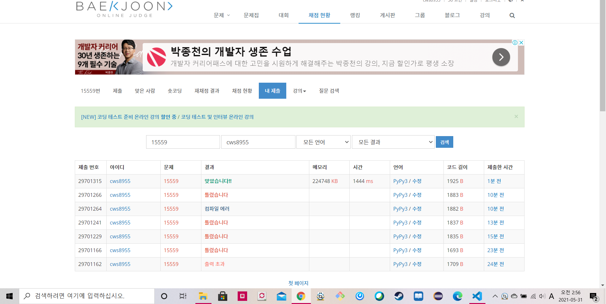

[백준 : 내 선물을 받아줘] (https://www.acmicpc.net/problem/15559)

 

- 그래프 + dfs + 분리집합이 활용된 문제
- 그래프 안에서의 이동은 dfs를 활용 , 합치는 과정은 분리집합을 활용
- 다만 주의할 점 두가지!!!!
  - 첫번째 주의할점은 union함수에서 `if rootA == rootB: return False`이다. 이 코드는 중복된 위치를 탐색할 경우를 방지하기 위한 코드이다.
  
  - 두번째 주의할점, 이차원 배열로 주어지므로 parents값을 어떻게 할지 헷갈리다가 그냥 1행1열 1행 2열 ... 1행 n열 , 그리고 2행 1열 이렇게 1씩 증가하는 방식으로 parents를 잡았다
  
  - 마지막으로 두가지에는 안들어가지만 추가로 주의할점은 마지막 
  
    `ans.add(find(parents[(y*m)+(x+1)]))`를 써야하고 
  
    `ans.add(parents[(y*m)+(x+1)])` 얘는 쓰지 않는 다는 것이다.
  
    


```python
import sys
sys.stdin = open('15559.txt','r')


def find(a):
    if parents[a] == a:
        return a
    parents[a] = find(parents[a])
    return parents[a]

def union(a,b):
    rootA = find(a)
    rootB = find(b)
    if rootA == rootB:
        return False

    if rootA < rootB:
        parents[rootB] = rootA
    else:
        parents[rootA] = rootB
    return True

def go(y,x):
    global n,m,parents,visit,arr
    
    print(y,x)

    if arr[y][x] == 'N':
        ny = y-1
        nx = x
        if 0<=ny<n and 0<=nx<m:
            visit[ny][nx] = 1
            result = union(find(parents[(y*m)+(x+1)]),find(parents[(ny*m)+nx+1]))
            if result == False:
                return
            go(ny,nx)
    if arr[y][x] == 'S':
        ny = y+1
        nx = x
        if 0<=ny<n and 0<=nx<m:
            visit[ny][nx] = 1
            result = union(parents[(y*m)+(x+1)],parents[(ny*m)+nx+1])
            if result == False:
                return
            go(ny,nx)
    if arr[y][x] == 'W':
        ny = y
        nx = x-1
        if 0<=ny<n and 0<=nx<m:
            visit[ny][nx] = 1
            result = union(parents[(y*m)+(x+1)],parents[(ny*m)+nx+1])
            if result == False:
                return
            go(ny,nx)
    if arr[y][x] == 'E':
        ny = y
        nx = x+1
        if 0<=ny<n and 0<=nx<m:
            visit[ny][nx] = 1
            result = union(parents[(y*m)+(x+1)],parents[(ny*m)+nx+1])
            if result == False:
                return
            go(ny,nx)

    return


n,m = map(int, input().split())
parents = [i for i in range((n*m)+1)]
visit = [[0]*m for _ in range(n)]
arr = []

for _ in range(n):
    arr1 = list(input())
    arr.append(arr1)


for y in range(n):
    for x in range(m):
        if visit[y][x] == 0:
            visit[y][x] = 1
            go(y,x)
            print(y,x,parents)


# print(visit)
print(parents)

ans = set()
for y in range(n):
    for x in range(m):
        ans.add(find(parents[(y*m)+(x+1)]))

print(ans)
```

