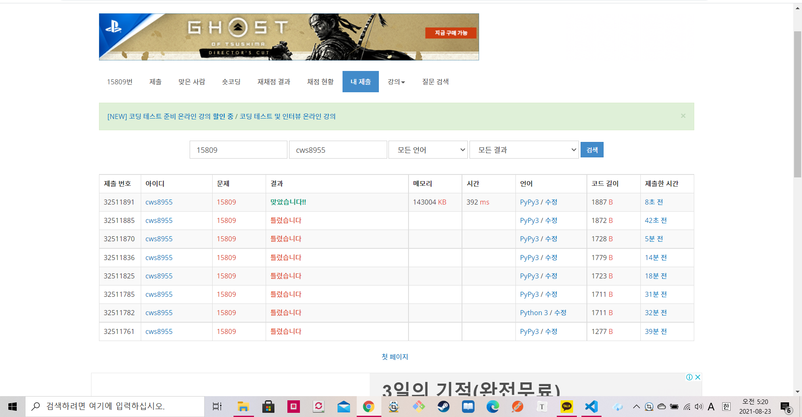

[ 백준 : 전국시대 ] (https://www.acmicpc.net/problem/15809)


- 일반적인 분리집합 문제이지만 헷갈릴만한 요소가 많이 존재한다

- 중간에 소팅을 안했거나, answer를 set으로 설정하는 실수를 범해서 틀렸었다......

- ```python
  import sys
  sys.stdin = open('15809.txt','r')
  
  def find(x):
      if parents[x] == x:
          return x
      parents[x] = find(parents[x])
      return parents[x]
  
  def union(a,b):
      rootA = find(a)
      rootB = find(b)
  
      # if arr[rootA] == 0 and arr[rootB] != 0:
      #     parents[rootA] = rootB
      #     arr[rootB] += arr[rootA]
      #     arr[rootA] = 0
      # elif arr[rootA] != 0 and arr[rootB] == 0:
      #     parents[rootB] = rootA
      #     arr[rootA] += arr[rootB]
      #     arr[rootB] = 0
      if arr[rootA] == 0 and arr[rootB] == 0:
          return
      else:
          if rootA > rootB:
              parents[rootA] = rootB
              arr[rootB] += arr[rootA]
              arr[rootA] = 0
          else:
              parents[rootB] = rootA
              arr[rootA] += arr[rootB]
              arr[rootB] = 0
  
      return
  
  def war(a,b):
      root_a = find(a)
      root_b = find(b)
      cnt_a = arr[root_a]
      cnt_b = arr[root_b]
  
      if cnt_a == cnt_b:
          arr[root_a] = 0
          arr[root_b] = 0
      elif cnt_a > cnt_b:
          arr[root_a] = cnt_a - cnt_b
          parents[root_b] = root_a
          arr[root_b] = 0
      else:
          arr[root_b] = cnt_b - cnt_a
          parents[root_a] = root_b
          arr[root_a] = 0
  
      return
  
  
  
  
  n,m = map(int, input().split())
  parents = [i for i in range(n+1)]
  arr = [0]
  for _ in range(n):
      a = int(input())
      arr.append(a)
  
  # print('----------------------------')
  # print(parents)
  # print(arr)
  for _ in range(m):
      _war,a,b = map(int, input().split())
      if _war == 1:
          union(a,b)
      else:
          war(a,b)
      # print('----------------------------')
      # print(parents)
      # print(arr)
  
  
  answer = []
  for a in arr:
      if a > 0:
          answer.append(a)
  
  print(len(answer))
  answer.sort()
  for ans in answer:
      print(ans, end=' ')
  
  
  
  # answer = set(arr)
  # answer = list(answer)
  # answer.sort()
  # answer.remove(0)
  # print(len(answer))
  # for ans in answer:
  #     print(ans, end=' ')
  
  
  ```

