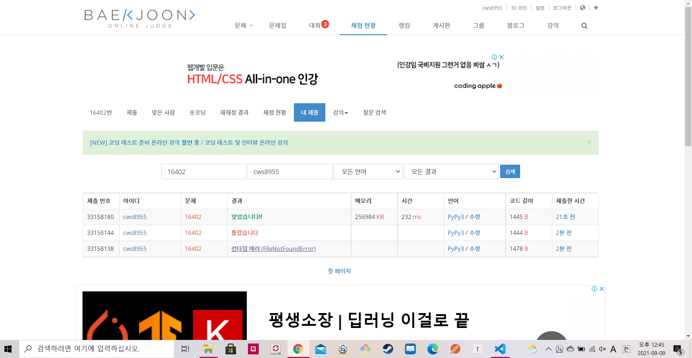

[ 백준 : 제국 ] (https://www.acmicpc.net/problem/16402)


- 분리집합 문제
- 한 번 틀렸었는데 틀린 이유는 Kingdom의 K를 소문자로 해서 틀렸었다.
- 기존 분리집합 문제 풀때는 parents만 활용했는데 반란이 일어나는 경우를 체크하기 위해 origin_parents 배열을 추가로 작성하여 문제를 풀었다.


```python
import sys
sys.stdin = open('16402.txt','r')
sys.setrecursionlimit(10**5)

def find(x):
    if parents[x] == x:
        return x
    parents[x] = find(parents[x])
    return parents[x]

def union(a,b):
    rootA = find(a)
    rootB = find(b)

    parents[rootB] = rootA

    return

def reunion1(a,b,c):

    # 현재 a국 b가 반란

    if c == 1: # a가 승리
        pass
    else:
        rootA = find(a)
        rootB = original_parents[b]
        parents[rootB] = rootB
        parents[rootA] = rootB

    return

def reunion2(a,b,c):

    # 현재 b국 a가 반란

    if c == 2: # b가 승리
        pass
    else:
        rootB = find(b)
        rootA = original_parents[a]
        parents[rootA] = rootA
        parents[rootB] = rootA

    return

n,m = map(int,input().split())
parents = {}
original_parents = {}
for k in range(n):
    nation = input()
    name = nation[11:]
    parents[name] = name
    original_parents[name] = name

for k in range(m):
    lst = list(map(str, input().split(',')))
    a = lst[0][11:]
    b = lst[1][11:]
    c = int(lst[2])
    if find(a) != find(b):
        if c == 1:
            union(a,b)
        else:
            union(b,a)
    elif find(a) == a:
        reunion1(a,b,c)
    else:
        reunion2(a,b,c)

# print(parents)
answer = []
for idx,val in parents.items():
    if idx == val:
        answer.append(idx)

answer.sort()
# print(answer)
print(len(answer))
for ans in answer:
    print('Kingdom of {}'.format(ans))

```



