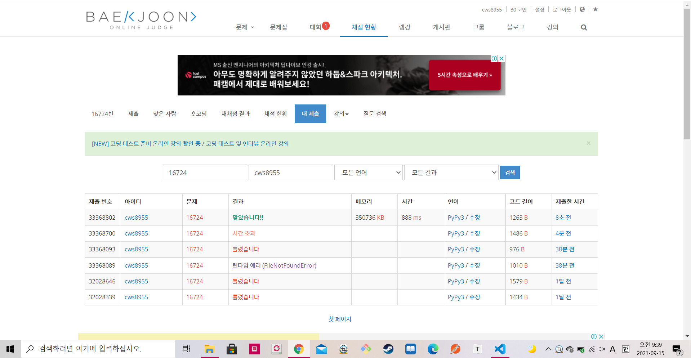

[ 백준 : 피리 부는 사나이 ] (https://www.acmicpc.net/problem/16724)


- 생각보다 힘들었던 문제
- 단순하게 싸이클만 찾으면 된다고 생각해서 초반에 틀렸었다.
- 이미 완성된 싸이클에 새로운 공간들이 편입될 경우를 추가해줘서 해결했다.


```python
import sys
sys.stdin = open('16724.txt','r')
sys.setrecursionlimit(10**5)

def find(x):
    if parents[x] == x:
        return x
    parents[x] = find(parents[x])
    return parents[x]

def union(a,b):
    rootA = find(a)
    rootB = find(b)

    parents[rootB] = rootA

    return

def dfs(y,x,t):
    global n,m,parents,visit,arr,flag

    ny = y
    nx = x

    if arr[y][x] == 'D':
        ny = y+1
    elif arr[y][x] == 'U':
        ny = y-1
    elif arr[y][x] == 'L':
        nx = x-1
    else:
        nx = x+1

    a = x + (y*m)
    b = nx + (ny*m)

    if visit[ny][nx] == 0:
        visit[ny][nx] = 1
        if flag == False:
            t.append([ny,nx])
        union(a,b)
    else:
        rootB = find(b)
        for tt in t:
            aa = tt[1] + (tt[0]*m)
            parents[aa] = rootB
            flag = True
        return
        
        
    visit[ny][nx] = 1
    dfs(ny,nx,t)

    return

n,m = map(int, input().split())
parents = [i for i in range(n*m)]
visit = [[0]*m for _ in range(n)]
arr = []
for _ in range(n):
    ar = list(input())
    arr.append(ar)

for y in range(n):
    for x in range(m):
        if visit[y][x] == 0:
            flag = False
            visit[y][x] = 1
            t = [[y,x]]
            dfs(y,x,t) 
            
print(len(set(parents)))
```

