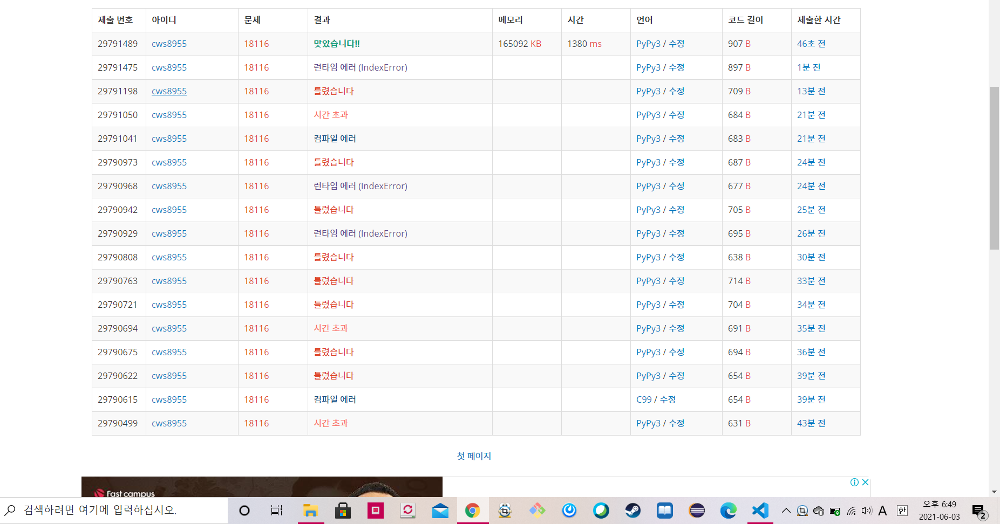

[백준 : 로봇 조립] (https://www.acmicpc.net/problem/18116)


- 은근히 까다로웠던 문제
- union 함수내에서 
- `numbers[sb] = 0` 해당 작업을 하지 않아서 계속 중복해서 더해지는 문제점 때문에 많이 틀렸다.

```python
import sys
sys.stdin = open('18116.txt','r')

def find(x):
    if parents[x] == x:
        return x
    parents[x] = find(parents[x])
    return parents[x]

def union(a,b):
    rootA = find(a)
    rootB = find(b)
    # print(rootA, rootB)

    if rootA < rootB:
        ss = find(rootA)
        sb = find(rootB)
        parents[rootB] = rootA
        numbers[ss] += numbers[sb]
        numbers[sb] = 0
        # print(ss,sb,numbers[ss],numbers[sb])
    elif rootA > rootB:
        ss = find(rootB)
        sb = find(rootA)
        parents[rootA] = rootB
        numbers[ss] += numbers[sb]
        numbers[sb] = 0

    return

n = int(input())
parents = [i for i in range(11)]
numbers = [1]*(11)
for _ in range(n):
    arr = list(map(str, sys.stdin.readline().split()))
    if len(arr) == 3:
        union(int(arr[1]),int(arr[2]))
        # print(numbers)
    else:
        ss = find(parents[int(arr[1])])
        print(numbers[ss])

# print(numbers)


```


