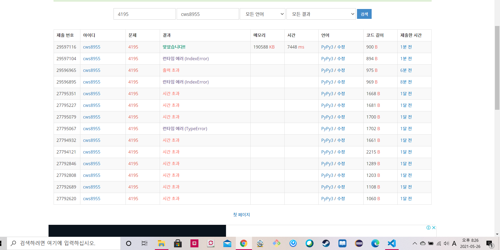

[백준 : 친구 네트워크] (https://www.acmicpc.net/problem/4195)


- 딕셔너리를 추가적으로 활용하는 유니온 파인드 문제였다.
- 딕셔너리에 `처음 나온 유저의 이름 : 기존 최대 유저의 번호+1` 형식으로 저장한다.
- 이렇게 저장이 된다면 딕셔너리의 값과 parents 리스트의 인덱스는 대응이 된다.
- 그 후 기존에 유니온 파인드를 풀던 방식으로 풀었다.


```python
import sys
sys.stdin = open('4195.txt','r')
from collections import defaultdict

def find(a):
    if parents[a] == a:
        return a
    parents[a] = find(parents[a])
    return parents[a]

def union(a,b):
    rootA = find(a)
    rootB = find(b)

    if rootA != rootB:
        parents[rootB] = rootA
        total[rootA] += total[rootB]

    return


tc = int(input())
for _ in range(tc):
    n = int(input())
    dict_ = defaultdict(int)
    parents = [i for i in range(n+1)]
    total = [1]*(n+1)
    number = 0
    for _ in range(n):
        a,b = map(str, input().split())
        value = dict_.get(a)
        value2 = dict_.get(b)
        if value == None:
            dict_[a] = number
            number += 1
        if value2 == None:
            dict_[b] = number
            number += 1

        union(dict_[a],dict_[b])

        result = min(dict_[a],dict_[b])
        tmp = find(parents[result])
        print(total[tmp])


```

