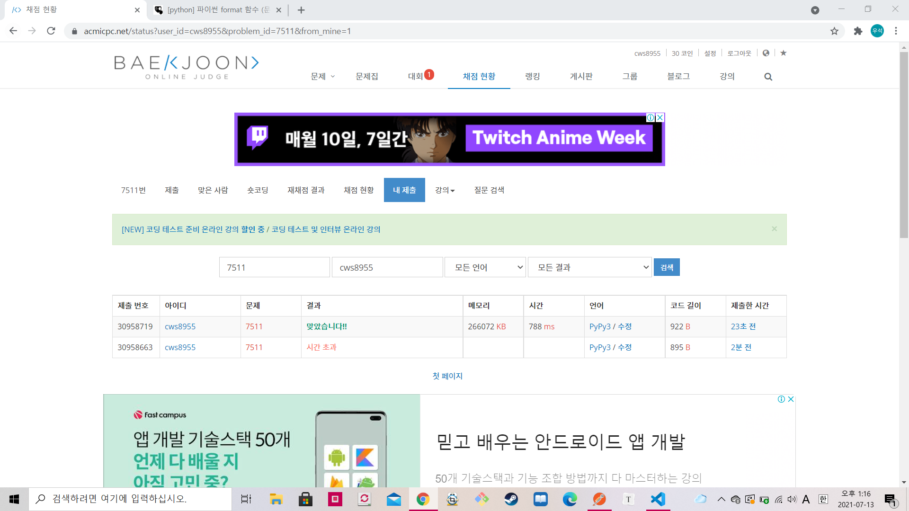

[백준 : 소셜 네트워킹 어플리케이션] (https://www.acmicpc.net/problem/7511)


- 모든 관계를 union 시킨 후 check함수를 통해 둘의 parents가 같은지를 비교해준다.
- 시간초과는 `input= sys.stdin.readline`을 통해 해결했다.


```python
import sys
sys.setrecursionlimit(10**5)
sys.stdin = open('7511.txt','r')
input = sys.stdin.readline

def find(x):
    if parents[x] == x:
        return x
    parents[x] = find(parents[x])
    return parents[x]


def union(a,b):
    rootA = find(a)
    rootB = find(b)

    if rootA < rootB:
        parents[rootB] = rootA
    else:
        parents[rootA] = rootB

    return

def check(a,b):
    rootA = find(a)
    rootB = find(b)

    if rootB == rootA:
        return True
    else:
        return False

t = int(input())
for tc in range(1,t+1):
    print('Scenario {}:'.format(tc))
    n = int(input())
    m = int(input())
    parents = [i for i in range(n+1)]
    for _ in range(m):
        a,b = map(int,input().split())
        union(a,b)

    k = int(input())
    for _ in range(k):
        a,b = map(int, input().split())
        result = check(a,b)
        if result == True:
            print(1)
        else:
            print(0)
    print()

    # print(parents)
```

