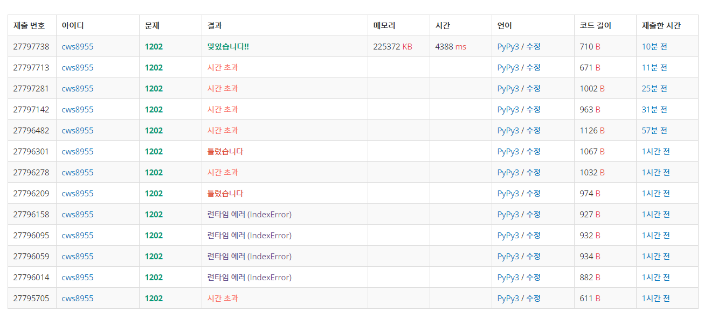

[백준 : 보석도둑] (https://www.acmicpc.net/problem/1202)


- 시간초과에 상당히 애먹었던 문제
- heapq를 총 세 번이나 사용하는 알고리즘을 통해 문제를 해결했다.
- 먼저 보석의 리스트를 보석의 무게 기준으로 heapq를 만든다 (pq)
- 그 다음 가방도 무게를 기준으로 heapq를 만든다(bq)
- bq를 우선순위에 따라 하나씩 꺼낸다
- bq에서 꺼낸 무게보다 낮거나 같은 무게를 가진 보석들은 temp라는 heapq에 또 넣어준다.
- temp에서 가장 큰 값을 answer에 더 해준다.
- 이를 반복하면서 보석의 heapq가 빌 경우 break를 해준다


#### 핵심

- 기존에 heapq를 빼줄때 무조건 pop을 했었다. 그러나 이번 문제를 풀면서 조건을 설정한 후 heapq에서 빼는 방식을 터득했다.
- heapq는 만능인것 같다..... 지금까지는


```python
import sys
sys.stdin = open('1202.txt','r')
import heapq

n,m = map(int,input().split())
pq = []
for _ in range(n):
    jewel = list(map(int, input().split()))
    heapq.heappush(pq,[jewel[0],jewel[1]])


answer = 0
bq = []
for k in range(m):
    bag = int(input())
    heapq.heappush(bq,[bag,k])

cnt = 0
ll = len(bq)
temp = []
while cnt < ll:
    bag_weight, bag_number = heapq.heappop(bq)

    ll2 = len(pq)
    cn = 0

    while pq and bag_weight >= pq[0][0]:
        [weight, value] = heapq.heappop(pq)
        heapq.heappush(temp, -value)

    if temp:
        answer -= heapq.heappop(temp)
    elif len(pq) == 0:
        break

    cnt += 1


print(answer) 


```


