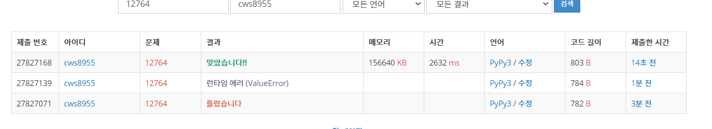

[백준 : 싸지방에 간 준하] (https://www.acmicpc.net/problem/12764)


##### 2021.03.30 '다시 열심히 하자'

- 로직
- heapq를 활용한 자료구조 문제다.
  - 1. computers라는 배열을 충분한 길이만큼 만든다. (index는 컴퓨터의 번호, value는 사용자의 수)
    2. use라는 배열도 computers와 같은 길이 만큼 만들어준다. (index는 컴퓨터의 번호, value는 현재 사용중인 친구가 컴퓨터를 종료하는 시간을 넣어준다. 0인 경우에는 빈 상태)
    3. out_cnt = 현재 몇 명이 사용했는지 숫자를 세는 유무
    4. pq = 군인들의 배열 (시작시간을 우선순위로)
    5. end_pq = 사용시작한 친구들의 종료시간과 사용중인 컴퓨터의 index번호를 넣어준 우선순위 큐
  - 세부로직
    - 1. 현재 기준으로 가장 빠르게 사용하려는 친구를 데려온다.
      2. 그 친구의 시작시간을 time이라는 변수에 넣은 후 time전에 전에 혹시 사용을 그만두는 친구가 있는지 확인 
         1. 있을 경우 그만 두는 친구가 사용하던 computer를 빈 컴퓨터로 만들기
      3. 사용하려는 친구에게 비어있는 컴퓨터중 가장 빠른 컴퓨터를 이용하게 한다.
      4. 그리고 그 컴퓨터에 이용자수를 +1 한다.
      5. 또한 해당 컴퓨터의 use에 종료시간을 넣는다.
      6. 마지막으로 이용중인 유저를 의미하는 heapq에 종료시간과 , 사용하는 컴퓨터 번호로 이루어진 값을 넣는다.


```python
import sys
sys.stdin = open('12764.txt','r')
import heapq

n = int(input())
computers = [0]*(n+1) # 총 갯수
use = [0]*(n+1) # 사용중의 유무 -> 0 대신 끝나는 시간 넣기

pq = []
for _ in range(n):
    start,end = map(int, input().split())
    heapq.heappush(pq,[start,end])

out_cnt = 0
time = 0
now_computer = 0
end_pq = []

while out_cnt != n:
    start,end = heapq.heappop(pq)

    time = start

    while end_pq and end_pq[0][0] < time:
        endd, in_computerr = heapq.heappop(end_pq)
        use[in_computerr] = 0 


    in_computer = use.index(0)
    computers[in_computer] += 1
    use[in_computer] = end
    heapq.heappush(end_pq,[end,in_computer])

    out_cnt += 1

idx = computers.index(0)
# print(idx)
# print(computers)
print(idx)

computers = computers[:idx]

for co in computers:
    print(co, end= ' ')
    
 


```


 