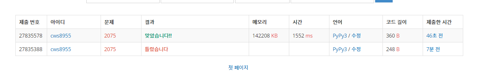

[백준 : N번째 큰 수] (https://www.acmicpc.net/problem/2075)


##### 2021.03.30


- 우선순위큐를 input이 들어올때 마다 활용하는 문제이다.
- 로직
  - 각 행이 들어올때 마다 우선순위 큐에 넣어준다.
  - 우선순위 큐의 길이가 n이 될때 까지 작은 애들을 순서대로 pop한다.
  - 마지막 줄까지 해당 과정이 진행될 경우 우선순위큐에는 가장 큰 n개가 남는다.
  - 이 중 맨 첫번째 요소가 남은 녀석 중 제일작은 , 전체로 보면 n번째 작은 요소이다.


```python
import sys
sys.stdin = open('2075.txt','r')
import heapq

n = int(input())

pq = []

for _ in range(n):
    arr = list(map(int,input().split()))

    for ar in arr:
        heapq.heappush(pq,ar)

    ll = len(pq)
    # print(ll,pq)

    while ll>n:
        # print(ll,n)
        r = heapq.heappop(pq)
        ll -= 1

# print(pq)
answer = 0
# for _ in pq:
p = heapq.heappop(pq)
answer = p

print(answer)

```


