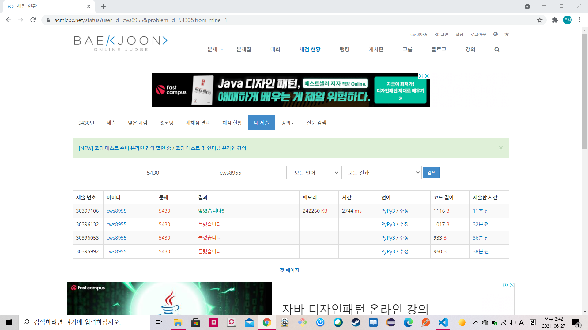

[백준 : AC] (https://www.acmicpc.net/problem/5430)


- 문자열의 파싱관련해서 실수를 계속해서 힘들었던 문제
- 2021.06.27에 해결


```python
import sys
sys.stdin = open('5430.txt','r')
from collections import deque
# input = sys.stdin.readline


t = int(input())
for tc in range(t):
    commands = list(input())
    number = int(input())
    arr = input()
    if arr == '[]':
        arr = []
        arr = deque()
    else:
        arr = arr[1:-1]
        arr = list(map(str,arr.split(',')))
        arr = deque(arr)
    d = 0

    l = len(commands)
    flag = True
    cnt = 0
    ll = len(arr)
    while cnt < l:
        c = commands[cnt]
        if c == 'R':
            if d == 0:
                d = 1
            else:
                d = 0
        else:
            if len(arr) > 0:
                if d == 0:
                    arr.popleft()
                else:
                    arr.pop()
            else:
                flag = False
                break
        cnt += 1

    if flag == False:
        print('error')
    else:
        if d == 0:
            pass
        else:
            arr.reverse()

        l = len(arr)
        answer = '['
        for a in range(l):
            answer += arr[a]
            if a != l-1:
                answer +=','
        answer += ']'

        print(answer)
```

